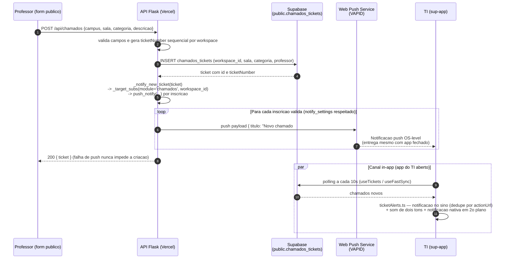

# API Backend

> Documentacao da API Flask que serve o sub-app ReservaLab.

---

## Visao Geral

O backend e um servidor Flask rodando como **Python Serverless** na Vercel. Ele e responsavel por:

- Buscar e processar dados de reservas de laboratorios via planilhas Excel no SharePoint
- Enviar notificacoes push para dispositivos inscritos
- Fornecer um endpoint de health check

**URL Base:** `/api/*` (via Vercel Serverless)  
**Porta Local:** 5000 (para desenvolvimento)

---

## Endpoints

### GET /api/reservas

Retorna as reservas de laboratorio do dia e da semana.

**Resposta:**

```json
{
  "lab1_reservas": [...],
  "lab2_reservas": [...],
  "reservas_semana": [...],
  "data": "01 de Julho de 2026",
  "cache_info": { "timestamp": 1688169600 }
}
```

**Fonte de dados:** Planilha Excel no SharePoint (aba "RESERVA LAB. INFORMÁTICA")

**Cache:** 60 segundos

---

### GET /api/health

Retorna o status do servidor e informacoes sobre o cache.

**Resposta:**

```json
{
  "status": "ok",
  "cache": {
    "ativo": true,
    "ttl": 60,
    "timestamp": 1688169600
  },
  "url_configurada": true
}
```

---

### POST /api/push/subscribe

Inscreve um dispositivo para receber notificacoes push.

**Body:**

```json
{
  "endpoint": "https://fcm.googleapis.com/fcm/send/...",
  "keys": {
    "p256dh": "...",
    "auth": "..."
  },
  "user": {
    "id": "uuid-do-usuario",
    "name": "Nome",
    "role": "admin"
  }
}
```

O campo `user` identifica o dono do dispositivo e permite envio direcionado por cargo. Inscricoes com o mesmo `endpoint` sao deduplicadas.

**Resposta:**

```json
{
  "status": "ok"
}
```

---

### POST /api/push/send

Envia uma notificacao para os subscribers, filtrando por modulo, workspace, cargo e usuario.

**Body:**

```json
{
  "title": "Novo usuário pendente",
  "body": "Maria (maria@x.com) aguarda aprovação",
  "url": "/admin/users",
  "role": "admin",
  "userId": "uuid-do-usuario-pendente",
  "module": "stock",
  "workspace_id": "uuid-do-workspace",
  "actions": [
    { "action": "approve", "title": "Aprovar" },
    { "action": "reject", "title": "Recusar" }
  ]
}
```

- `module`: envia apenas para subscribers com acesso ao app (campo `apps` da inscricao). Inscricoes legadas (sem `apps`) continuam recebendo de todos os modulos.
- `workspace_id`: envia apenas para subscribers do workspace (super admins recebem de todos). Omita para enviar a todos os workspaces.
- `role`: envia apenas para subscribers com esse cargo (se omitido, envia para todos).
- `notify_settings` do subscriber e respeitada: `muted` bloqueia tudo; canal `push` desligado por app bloqueia aquele modulo.
- `actions`: botoes exibidos na notificacao (Web Push suporta max. 2; apenas Android Chrome/desktop).
- `userId`: usado pelo service worker no handler da acao.

**Resposta:**

```json
{
  "sent": 2,
  "total": 3
}
```

---

### POST /api/push/action

Aprova ou rejeita um usuario pendente a partir da acao da notificacao.

**Body:**

```json
{
  "action": "approve",
  "userId": "uuid-do-usuario-pendente",
  "role": "viewer",
  "app_access": {}
}
```

- `action`: `approve` ou `reject`.
- `role` e `app_access` (opcionais, so no approve) definem o cargo e os overrides por app; padrao: `viewer` e `{}`.

Requer `SUPABASE_URL` e `SUPABASE_SERVICE_KEY` no backend (retorna 503 sem elas).

**Resposta:**

```json
{
  "status": "approved",
  "role": "viewer"
}
```

---

### GET /api/push/test

Envia uma notificacao de teste para todos os subscribers inscritos.

**Resposta:**

```json
{
  "sent": 3,
  "total": 5
}
```

---

### Protecao por CRON_SECRET (endpoints de cron)

Os quatro endpoints de cron sao protegidos pela variavel `CRON_SECRET`:

- `GET /api/push/check` (reservas proximas)
- `GET /api/push/check-overdue` (emprestimos vencendo)
- `GET /api/push/check-pcare` (estoque baixo / manutencoes)
- `GET /api/push/check-all` (todos os checks em uma chamada)

Com `CRON_SECRET` configurada no projeto Vercel, o Cron Job envia automaticamente o header `Authorization: Bearer ${CRON_SECRET}` e os endpoints **exigem** esse header (qualquer outro acesso retorna `401`). Sem a variavel, ficam abertos (comportamento legado) para nao quebrar o fluxo durante a migracao — e um warning e registrado no log. Gere o valor com: `openssl rand -hex 32` e adicione em **Vercel > Project > Settings > Environment Variables** (nome: `CRON_SECRET`).

---

### GET /api/push/check

Verifica se ha reservas proximas e envia notificacoes push automaticamente. **Protegido por CRON_SECRET** (veja secao acima).

**Logica:**
1. Busca reservas de hoje
2. Para cada reserva, verifica se o horario esta dentro dos proximos 15 minutos
3. Envia push para todos os subscribers
4. Deduplicacao via MD5 com TTL de 2 horas
5. Tambem verifica reservas de tablets no Supabase

**Resposta:**

```json
{
  "checked": true,
  "sent": 2,
  "subscribers": 5
}
```

---

### GET /api/push/check-overdue

Verifica emprestimos com devolucao prevista nas proximas 12 horas e envia push. **Protegido por CRON_SECRET** (veja secao acima).

---

### GET /api/push/check-pcare

Verifica estoque baixo de pecas e manutencoes agendadas (hoje/amanha) e envia push. **Protegido por CRON_SECRET** (veja secao acima).

---

### GET /api/push/check-all

Roda todos os checks de cron em uma unica chamada (reservas, devolucoes vencendo, pcare, usuarios pendentes e validade de itens). Usado pelo **Cron do Vercel** (substituiu o cron-jobs.org). **Protegido por CRON_SECRET** (veja secao acima).

**Agendamento (vercel.json):**

```json
{
  "crons": [
    { "path": "/api/push/check-all", "schedule": "*/5 * * * *" }
  ]
}

```

**Resposta:**

```json
{
  "checked": true,
  "results": {
    "reservas": { "checked": true, "sent": 2, "subscribers": 5 },
    "overdue": { "checked": true, "sent": 0, "found": 0, "subscribers": 3 }
  }
}
```

---

## Fluxo: Notificacao de Chamados (Sup-app)

Quando um professor abre um chamado pelo formulario publico (`/chamados-publico`), o sup-app (app do TI) recebe a notificacao **imediatamente**, sem depender de cron ou de servicos externos. O envio e disparado por **evento**, dentro da propria requisicao que cria o chamado.



### 1. Criacao do chamado — `POST /api/chamados`

O formulario publico (professor, sem login) envia o chamado. O backend valida os campos, gera o `ticketNumber` sequencial por workspace e insere no Supabase (`public.chamados_tickets`). **Esse endpoint tambem e usado pelo proprio app do TI** quando cria um chamado internamente.

### 2. Push imediato — `_notify_new_ticket(ticket)`

Imediatamente apos o INSERT, o backend chama o helper `_notify_new_ticket` (definido em `api/app.py`):

- **Segmentacao:** `_target_subs(module='chamados', workspace_id=ticket.workspace_id)` — alcanca apenas inscricoes push de usuarios com acesso ao modulo `chamados` **e** ao workspace do campus (super admins recebem de todos).
- **Respeito ao perfil:** `notify_settings` do usuario e respeitada (`muted` bloqueia tudo; canal `push` desligado para o app `chamados` bloqueia so ele).
- **Mensagem:** titulo `Novo chamado #{ticketNumber}`; corpo `Sala · Categoria · Professor`; toque leva para `/chamados/tickets/{id}`.
- **Resiliencia:** qualquer falha de push e capturada (try/except) e **nunca impede** a criacao do chamado — o professor recebe o `200` normalmente.

### 3. Notificacao in-app (app do TI aberto)

Independente do push, o sup-app tambem detecta o chamado novo via polling de 10s (`useTickets` / `useFastSync(['chamados'])` em `ChamadosLayout`) e o `ticketAlerts.ts`:

- Cria a notificacao no sino (in-app) com dedupe por `actionUrl`;
- Toca um som curto de dois tons (silenciável no header do app);
- Exibe notificacao nativa do navegador quando a pagina esta em segundo plano.

Os dois canais (push OS-level + in-app) sao complementares: o push garante o aviso mesmo com o app fechado; o in-app cobre a experiencia dentro do aplicativo.

---

## Estrutura do Backend

```
src/apps/reservalab/api/
├── app.py              # Servidor Flask principal
├── .env                # Variaveis de ambiente
└── REGRAS_ARQUITETURA.md
```

---

## Padroes de Codigo

### Modulos

Cada modulo novo segue este padrao:

```python
# api/meu_modulo.py — SEM Flask, SEM app = Flask()
import logging
logger = logging.getLogger(__name__)

def get_meus_dados(parametro=None):
    try:
        # logica aqui
        return {'dados': [...], 'total': N}
    except Exception as e:
        logger.error(f"Erro: {e}")
        return {'error': str(e), 'dados': [], 'total': 0}
```

### Registro de Modulos

```python
import importlib.util as _ilu
_mod_path = os.path.join(BASE_DIR, 'api', 'meu_modulo.py')
_mod_spec = _ilu.spec_from_file_location('meu_modulo', _mod_path)
_mod = _ilu.module_from_spec(_mod_spec)

try:
    _mod_spec.loader.exec_module(_mod)

    @app.route('/api/minha-rota', methods=['GET'])
    def api_minha_rota():
        return jsonify(_mod.get_meus_dados())

    logger.info("Modulo carregado.")
except Exception as _e:
    logger.error(f"Modulo nao carregado: {_e}")
```

### Serializacao de Datas

```python
class DateEncoder(json.JSONEncoder):
    def default(self, obj):
        if isinstance(obj, (date, datetime)):
            return obj.strftime('%d/%m/%Y')
        return super().default(obj)
```

---

## Dependencias Python

- `flask` — Framework web
- `flask-cors` — CORS
- `openpyxl` — Leitura de planilhas Excel
- `requests` — Requisicoes HTTP
- `python-dotenv` — Variaveis de ambiente
- `upstash_redis` — Redis para push
- `pywebpush` — Web Push (VAPID)
- `hashlib` — Deduplicacao de push

---

## Variaveis de Ambiente

| Variavel | Obrigatorio | Descricao |
|----------|-------------|-----------|
| `SHAREPOINT_URL` | Sim | URL da planilha de reservas |
| `UPSTASH_REDIS_REST_URL` | Nao | URL do Upstash Redis |
| `UPSTASH_REDIS_REST_TOKEN` | Nao | Token do Upstash Redis |
| `SUPABASE_URL` | Nao | URL do Supabase |
| `SUPABASE_SERVICE_KEY` | Nao | Service key do Supabase |
| `CRON_SECRET` | Nao | Protege os endpoints de cron `GET /api/push/check`, `check-overdue`, `check-pcare` e `check-all` (o Vercel Cron envia `Authorization: Bearer ${CRON_SECRET}`) |

---

## Bugs Conhecidos e Correcoes

- `Object of type date is not JSON serializable` — Resolvido com `DateEncoder`
- Navbar muito alta no iPhone — Resolvido com `env(safe-area-inset-top)`
- Tela branca no PWA — Causada por cache do browser; solucao: reinstalar o app
