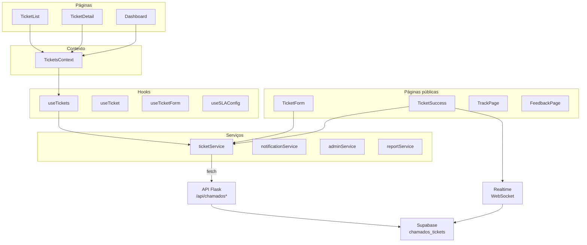

# Chamados — Arquitetura

> Como o Chamados funciona por dentro.

## Arquitetura de componentes



## Gerenciamento de estado

### TicketsContext

Compartilha o estado dos chamados dentro do layout do Chamados:

```typescript
{
  tickets: Ticket[]
  loading: boolean
  syncing: boolean
  reload: () => Promise<void>
  create: (data: TicketFormData) => Promise<Ticket>
  update: (id: string, data: Partial<Ticket>) => Ticket | undefined
  updateStatus: (id: string, status: TicketStatus) => Ticket | undefined
  remove: (id: string) => boolean
}
```

### Estado local

- `ticketService` mantém uma coleção local em `localStorage` (`labhub_chamados`)
- As operações escrevem primeiro no local e depois sincronizam via API
- O realtime fornece atualizações remotas instantâneas

## Fluxo de dados

### Abertura de chamado

```text
TicketForm → ticketService.create() → POST /api/chamados
    → o Flask valida e gera o ticketNumber
    → INSERT em chamados_tickets
    → notificação push para a equipe de TI
    → devolve o chamado ao frontend
```

### Atualização de status

```text
TicketDetail → updateStatus() → PATCH /api/chamados/:id
    → UPDATE no Supabase
    → o realtime propaga a mudança
    → o professor vê a atualização imediatamente
```

### Assinatura em tempo real

```text
useRealtimeSubscription('chamados_tickets', '*', callback)
    → o WebSocket recebe INSERT/UPDATE
    → o callback mescla no estado local
    → a interface é renderizada novamente
```

## Acesso a dados

- **Coleção local:** `labhub_chamados`, marcada como *local-only* na engine de sync
- **Acesso a dados:** exclusivamente pela API `ticketService` (`/api/chamados`), pois a tabela `chamados_tickets` tem RLS bloqueado para `anon` e `authenticated` — somente `service_role` acessa
- **Detecção de chamados novos:** polling de 10 segundos no layout do Chamados, complementado por push

## Estrutura de arquivos

```text
src/apps/chamados/
├── index.tsx                    # Definição de rotas
├── contexts/TicketsContext.tsx  # Estado compartilhado dos chamados
├── hooks/useTickets.ts          # Operações de CRUD
├── layouts/ChamadosLayout.tsx   # Layout principal com navegação
├── pages/
│   ├── Dashboard.tsx            # Estatísticas e visão de SLA
│   ├── TicketList.tsx           # Lista filtrada de chamados
│   └── TicketDetail.tsx         # Visão completa do chamado
├── services/
│   ├── ticketService.ts         # Comunicação com a API
│   ├── sla.ts                   # Cálculos de SLA
│   ├── slaConfigService.ts      # CRUD da configuração de SLA
│   ├── problemTemplateService.ts
│   ├── roomService.ts
│   └── ticketAlerts.ts          # Avisos de chamado novo no sino
├── types/
│   ├── ticket.ts                # Tipos de chamado
│   ├── events.ts                # Tipos de evento
│   ├── sla.ts                   # Tipos de SLA
│   └── problemTemplate.ts
└── components/                  # Componentes de interface
```

## Isolamento e RLS

**Permitido sem outras aplicações:** criar, listar, visualizar, alterar, comentar e fechar chamados; chamados sem `assetId`/`assetSource` funcionam normalmente; chamados antigos com `assetSource: 'pcare'` ou `'stock'` continuam sendo exibidos.

**Integração opcional:** `useRoomAssets` busca equipamentos via `core/assets/service` e, em caso de falha, retorna lista vazia. O campo `assetSource` é apenas um rótulo de integração e não gera dependência funcional.

**Segurança:**

- `chamados_tickets` tem `ENABLE ROW LEVEL SECURITY` e `REVOKE ALL ... FROM anon, authenticated, PUBLIC` — somente o backend (`service_role`) lê e escreve
- Todos os endpoints `/api/chamados*` exigem `SUPABASE_URL` e `SUPABASE_SERVICE_KEY`; sem elas, respondem 503
- As inscrições de push ficam no Upstash Redis, respeitando `notify_settings` do usuário
- Somente super admins ou admins do workspace aprovam usuários pendentes

## Relacionados

- [Visão geral](README.md)
- [Fluxos](workflows.md)
- [Referência](reference.md)
- [Arquitetura de backend](../../platform/architecture/backend.md)
