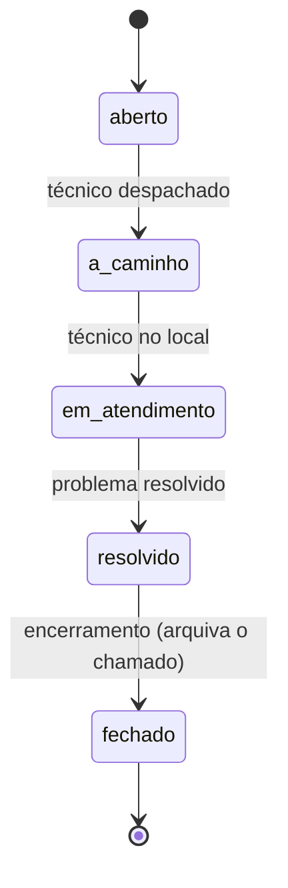
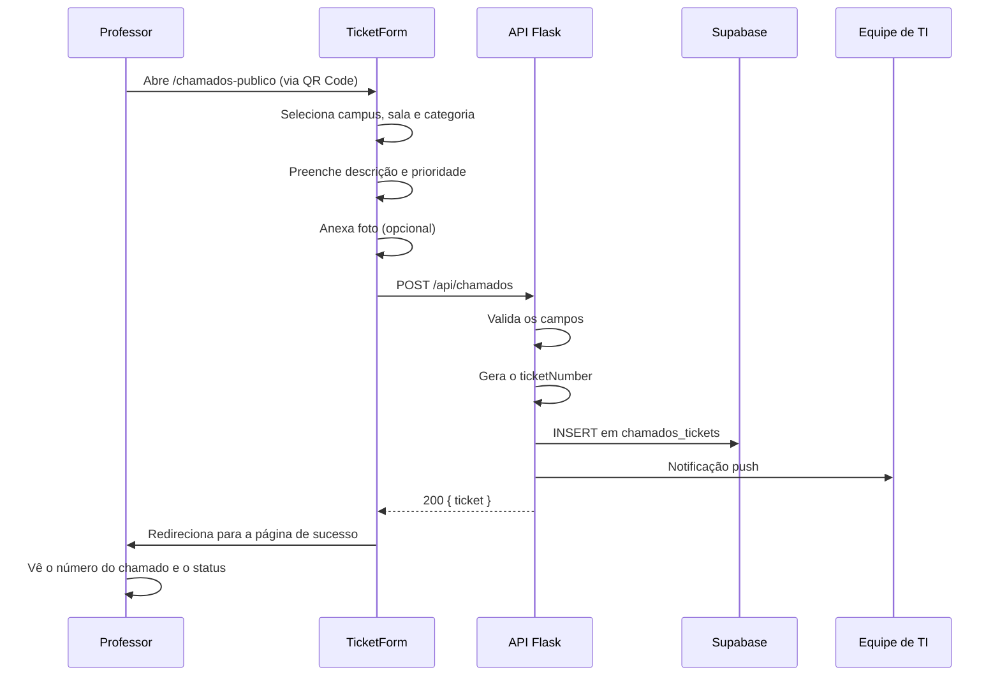
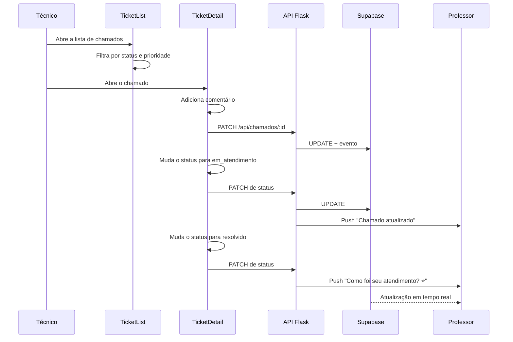
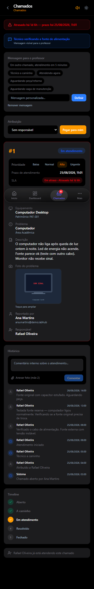
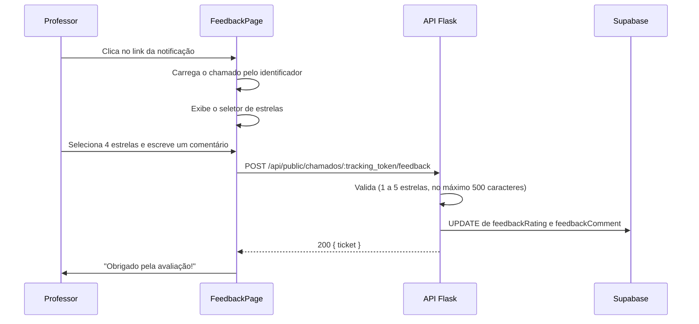
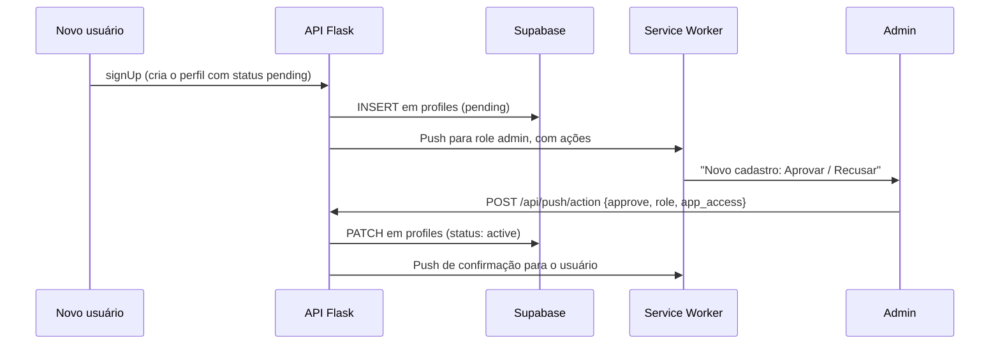

# Chamados — Fluxos

> Passo a passo dos fluxos de uso do Chamados.

## Ciclo de vida do chamado

Um chamado também pode ser arquivado a qualquer momento, o que o retira da visão ativa sem alterar o status.

## Fluxo 1 — Abertura de chamado (professor)

## Fluxo 2 — Atendimento do chamado (técnico)

O detalhe do chamado concentra a timeline de eventos, as fotos anexadas, o controle de SLA e o botão de avanço de status.

## Fluxo 3 — Avaliação do atendimento (professor)

Regras da avaliação:

- Acesso público: o identificador do chamado é o token de acesso
- Disponível apenas com status `resolvido` ou `fechado`
- Um chamado recebe no máximo uma avaliação, sem edição posterior
- A notificação de chamado resolvido traz link direto para o formulário

## Fluxo 4 — Aprovação de usuário (admin)

**Limitação do Web Push:** os botões de ação aparecem apenas no Chrome para Android e no desktop. No iOS/Safari a notificação apenas abre a URL definida, e o admin chega ao modal de aprovação pelo deep link `/admin/users?pending=<id>`.

## Fluxo 5 — Operações em lote (técnico)

1. Selecionar vários chamados pelas caixas de seleção
2. A barra de ações em lote apresenta as opções:
   - Arquivar selecionados
   - Atribuir a um técnico
   - Alterar prioridade
   - Alterar status
3. Confirmar no diálogo
4. Todos os chamados selecionados são atualizados
5. A lista é recarregada

## Relacionados

- [Visão geral](README.md)
- [Arquitetura](architecture.md)
- [Referência](reference.md)
