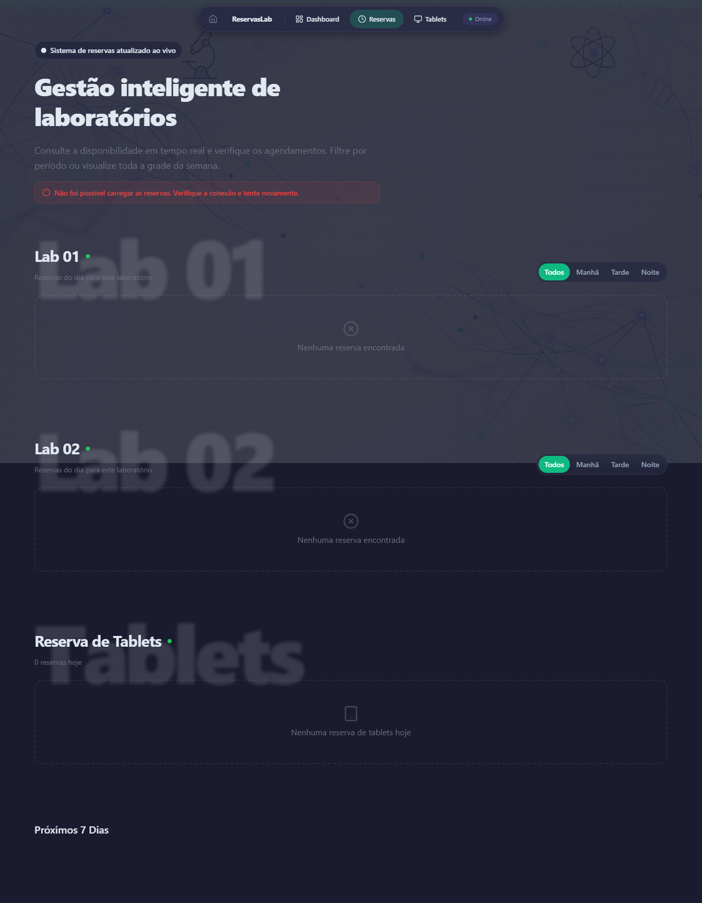
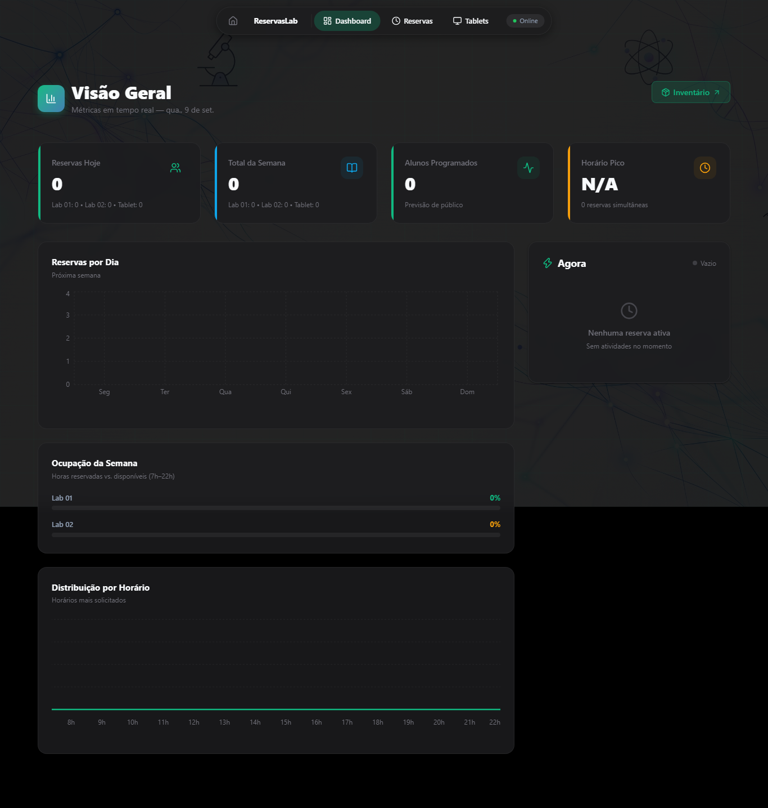
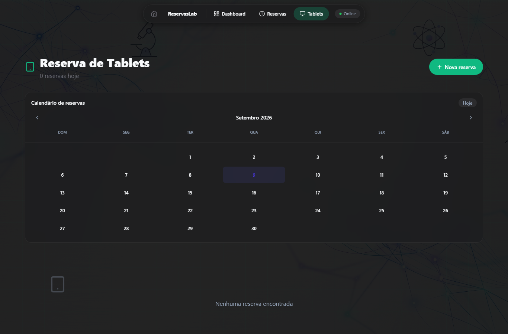

# ReservaLab

> Gestão de reservas de laboratórios e de tablets.

**Rota:** `/reservalab`
**Cor:** `#6366f1` (índigo)
**Código:** `src/apps/reservalab`

## Propósito

O ReservaLab gerencia as reservas dos laboratórios de informática e o empréstimo de tablets. As reservas de laboratório vêm de uma planilha Excel no SharePoint (somente leitura); as reservas de tablet são gerenciadas no Supabase.

O ReservaLab também hospeda o backend Flask principal do projeto, responsável por todas as rotas `/api/*`.

## O que resolve

- Professores e coordenação consultam a ocupação dos laboratórios em um calendário semanal, sem depender de planilha aberta
- Empréstimos de tablet passam a ter registro estruturado, com status e histórico
- Lembretes automáticos reduzem esquecimento e conflito de reserva

## Principais funcionalidades

- **Reservas de laboratório** — visualização do dia e da semana, a partir da planilha no SharePoint
- **Reservas de tablet** — CRUD completo no Supabase, com modal de cadastro e erros em linha
- **Dashboard** — gráficos de ocupação, totais, média diária e taxa de ocupação
- **Notificações push** — lembretes configuráveis antes do início da reserva (padrão de 30 minutos; laboratório e tablet), escopados por campus
- **Suporte a múltiplos laboratórios** — quantidade configurável por campus (`lab_count`)
- **Limpeza automática** — remoção de reservas de tablet canceladas há mais de 30 dias

## Fontes de dados

| Dado | Fonte | Acesso |
|------|-------|--------|
| Reservas de laboratório | Planilha Excel no SharePoint | API Flask (somente leitura) |
| Reservas de tablet | Supabase (`tablet_reservations`) | Acesso direto do cliente |
| Cache | Upstash Redis com fallback em arquivo | API Flask |

## Telas

Capturas da verificação visual automatizada do ReservaLab, em viewport 1366×900.

Calendário de reservas de laboratório, com o status visual de cada reserva (ao vivo, em breve, encerrada).

Dashboard de ocupação dos laboratórios.

Gestão de reservas de tablet.

> As imagens também demonstram que o ReservaLab acompanha o tema da aplicação principal; o conjunto completo (dark, dim e light) está em [`screenshots/e2e-reservalab-theme/`](../../../screenshots/e2e-reservalab-theme/), gerado por `scripts/e2e_theme_check.mjs`.

## Onde está a documentação

| Documento | Conteúdo |
|-----------|----------|
| [Arquitetura](architecture.md) | Backend Flask, rotas de API, cache, regras de arquitetura e variáveis de ambiente |
| [Referência](reference.md) | Tipos, contratos de resposta e testes |
| [Referência da API](../../reference/api.md) | Contrato completo dos endpoints |
| [Operações: Deploy](../../operations/deployment.md) | Publicação e rollback |

## Integrações e dependências

- **Backend Flask** — o ReservaLab é a única aplicação com backend próprio; todas as rotas `/api/*` do projeto vivem em `src/apps/reservalab/api/app.py`
- **SharePoint** — planilha de reservas por campus, configurada em `workspaces.spreadsheet_url`
- **Upstash Redis** — cache de reservas e inscrições de push
- **Supabase** — tabela `tablet_reservations`
- **Web Push (VAPID)** — lembretes de reserva
