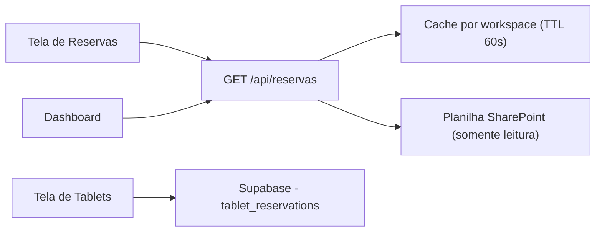

# ReservaLab — Arquitetura

> Backend, rotas, cache e regras de arquitetura do ReservaLab.

## Stack

| Camada | Tecnologia |
|--------|-----------|
| Frontend | React + Vite + TypeScript (`src/apps/reservalab/`) |
| Backend | Flask (Python) — `src/apps/reservalab/api/app.py`, a aplicação Flask principal do projeto, importada pelo entry point `api/app.py` da raiz |
| Deploy | Vercel (Python Serverless) + GitHub Actions (crons) |

## Fontes de dados

- **Reservas de laboratório** — planilha Excel no SharePoint, aba "RESERVA LAB. INFORMÁTICA", **por campus**. O link é configurado na interface do workspace (link da planilha) e salvo em `workspaces.spreadsheet_url`. A quantidade de laboratórios vem de `workspaces.lab_count` (padrão 2) e determina quantas seções (LAB01..LAB0N) a aplicação exibe. `SHAREPOINT_URL` é apenas um fallback global opcional. Não há banco de dados para as reservas de laboratório.
- **Tablets** — Supabase, tabela `tablet_reservations`. É o único uso de banco de dados na aplicação.
- **Inscrições de push** — Upstash Redis.

## Fluxo de dados



As telas de Reservas e Dashboard leem a planilha pelo backend, sempre com cache por workspace. A tela de Tablets fala direto com o Supabase e é o único ponto de escrita em banco da aplicação. Os crons de push reaproveitam as mesmas fontes.

## Arquitetura do backend

```text
api/app.py (raiz — entry point da Vercel)
└── importa src/apps/reservalab/api/app.py

app.py (Flask)
├── /api/reservas        → get_reservas(workspace_slug) → planilha no SharePoint
├── /api/health          → status do servidor e do cache
└── /api/push/*          → Upstash Redis + Web Push (VAPID)
```

O entry point da Vercel importa o app desta aplicação:

```python
# api/app.py (raiz)
sys.path.insert(0, os.path.join(os.path.dirname(__file__), '..', 'src', 'apps', 'reservalab', 'api'))
from app import app, _SUPABASE_URL, _SUPABASE_SERVICE_KEY, _supabase_headers, _target_subs, push_notify, redis
```

### Cache

- **Reservas** — TTL de 60 segundos, **por workspace**. A chave é `reservas_{slug}` no Redis (Upstash), com fallback em arquivo por chave. Um campus nunca pode receber o cache de outro.
- **Push** — deduplicação por MD5 com TTL de 2 horas.

## Rotas do frontend

| Rota | Página | Descrição |
|------|--------|-----------|
| `/reservalab/` | ReservasView | Calendário de reservas |
| `/reservalab/dashboard` | DashboardView | Dashboard com gráficos |
| `/reservalab/tablets` | TabletsView | Gestão de tablets |

## Rotas da API

Todas as rotas `/api/*` do projeto estão em `src/apps/reservalab/api/app.py`.

| Método | Rota | Descrição |
|--------|------|-----------|
| `GET` | `/api/reservas` | Reservas do dia e da semana (planilha), com `cache_info` |
| `GET` | `/api/health` | Status do servidor e do cache |
| `POST` | `/api/push/subscribe` | Inscrever um dispositivo para push |
| `GET` | `/api/push/test` | Enviar notificação de teste |
| `POST` | `/api/push/send` | Enviar push com filtro por aplicação, workspace, cargo e usuário |
| `POST` | `/api/push/action` | Aprovar ou recusar usuário pela notificação |
| `GET` | `/api/push/check` | Verificar e enviar push de reservas próximas |
| `POST` | `/api/push/notify-loan` | Notificar novo empréstimo |
| `POST` | `/api/push/notify-return` | Notificar devolução |
| `GET` | `/api/push/check-overdue` | Verificar empréstimos com prazo próximo |
| `GET` | `/api/push/check-pcare` | Verificar estoque baixo e manutenções |
| `GET` | `/api/push/tablets/cleanup` | Limpar reservas de tablet canceladas há mais de um mês |
| `GET` | `/api/push/check-all` | Cron agregado: executa todos os checks |

Os endpoints de cron (`/api/push/check*`) são protegidos por `CRON_SECRET` no cabeçalho `Authorization: Bearer ${CRON_SECRET}`.

## Fluxos de notificação

### Reservas

- Aviso automático antes do início da reserva, em janela configurável por `PUSH_ADVANCE_MINUTES` (padrão 30 minutos), para laboratório e tablet
- O alerta de laboratório é escopado por campus
- O alerta de tablet é filtrado por campus: só recebe quem tem acesso ao workspace da reserva, e super admins recebem de todos
- Limpeza automática de reservas de tablet canceladas há mais de um mês, com retenção configurável em `PUSH_TABLET_RETENTION_DAYS` (padrão 30 dias)

### Aprovação de cadastro

1. **Cadastro** — `authService.signUp` grava o perfil como `pending` e dispara push para a role `admin`, com ações e URL `/admin/users?pending=<id>`
2. **Notificação** — no service worker, os botões "Aprovar" e "Recusar" chamam `POST /api/push/action` (aprovar faz `PATCH profiles` com `status: active`; recusar faz `DELETE`)
3. **Clique no corpo da notificação** — abre `/admin/users?pending=<id>` no frontend
4. **Deep link** — a página de usuários detecta `?pending=<id>` e abre o modal de aprovação pré-preenchido
5. **Modal** — permite escolher o cargo (`viewer`, `technician` ou `admin`) e, opcionalmente, sobrescrever o acesso por aplicação

**Limitação:** os botões de ação só aparecem no Chrome para Android e no desktop. No iOS/Safari, a notificação apenas abre a URL, e o admin chega ao modal pelo deep link.

O endpoint `/api/push/action` não tem autenticação própria e exige `SUPABASE_URL` e `SUPABASE_SERVICE_KEY` configurados; sem eles, responde 503.

## Regras de arquitetura

1. **Toda rota `/api/` mora em `src/apps/reservalab/api/app.py`** — é a aplicação Flask principal do projeto.
2. **A planilha é somente leitura.** Reservas de laboratório vêm da planilha e nunca são escritas nela. A escrita no banco é exclusiva dos tablets (`tablet_reservations`).
3. **Cache por workspace é obrigatório.** `get_reservas(workspace_slug)` usa a chave `reservas_{slug}` no Redis, com fallback em arquivo. Nunca deixe um campus receber o cache de outro.
4. **`load_workbook` com `read_only=True, data_only=True`** — nunca carregue a planilha inteira em memória.
5. **Variáveis de ambiente:** nunca deixe valores fixos no código.
6. **Endpoints de cron** são protegidos por `CRON_SECRET`.
7. **Módulos novos são funções puras**, sem Flask: nunca levante exceção, retorne um dicionário com `error` e use `DateEncoder` para serializar datas.
8. **No frontend, cada tela busca seus próprios dados** — não centralize fetches. Novos componentes entram em `src/apps/reservalab/components/`.

## Estrutura de arquivos

```text
src/apps/reservalab/
├── api/app.py            # Servidor Flask principal do projeto (todas as rotas /api/*)
├── index.tsx             # Rotas da aplicação (Reservas, Dashboard, Tablets)
├── layouts/              # ReservaLabLayout (tema claro + navbar)
├── pages/                # Reservas.tsx, Dashboard.tsx, Tablets.tsx
├── components/           # Cards, modais, calendário semanal, navbar
├── hooks/                # useIsMobile
├── services/
│   ├── api.ts            # fetch /api/reservas (planilha)
│   └── supabase.ts       # CRUD de tablet_reservations (único acesso a banco)
├── types/                # Tipos compartilhados
└── utils/                # timeUtils (períodos e horários), labUtils (nomes dos labs)
```

## Relacionados

- [Visão geral](README.md)
- [Referência](reference.md)
- [Arquitetura de backend](../../platform/architecture/backend.md)
- [Referência da API](../../reference/api.md)
