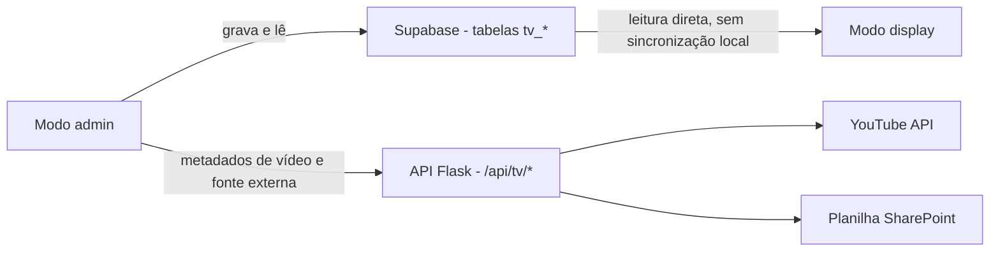

# TV

> Canal corporativo e murais digitais dos laboratórios.

**Rota:** `/tv` (admin) e `/tv/display` (exibição em tela cheia)
**Cor:** `#ef4444` (vermelho)
**Código:** `src/apps/tv`

## Propósito

A TV alimenta os murais digitais dos laboratórios, exibindo eventos, vídeos, música, avisos e galerias de fotos. Ela opera em dois modos: **admin**, para gestão de conteúdo, e **display**, para reprodução em tela cheia.

## O que resolve

- Informação institucional chega às telas dos laboratórios sem intervenção manual em cada máquina
- Eventos institucionais, avisos urgentes e conteúdo multimídia têm um canal único
- Cada campus controla seu próprio conteúdo, isolado por workspace

## Principais funcionalidades

- **Eventos** — criação, edição e ativação de eventos por campus; um evento pode ser direcionado a uma TV específica (`tv_events.device_id`) ou a todo o campus (`NULL`, exibido em todas). O **ReservaLab** cria um evento diretamente na TV corporativa a partir de uma reserva, escolhendo a TV do campus que deve exibi-lo
- **Playlists de vídeo** — integração com o YouTube, com busca de metadados
- **Música** — filas de reprodução em segundo plano e pedidos de música
- **Avisos** — mensagens em rolagem, incluindo alertas urgentes por severidade
- **Galerias de fotos** — carrosséis de imagens
- **Gestão de dispositivos** — códigos de ativação para as TVs
- **Fonte externa de eventos** — planilha do SharePoint/OneDrive, com validação de URL e cache por workspace

## Modo display

Apresentação em tela cheia com:

- Carrossel de eventos com transições
- Player de vídeo do YouTube
- Player de música com volume/mudo locais (persistidos no navegador do display)
- Áudio de fundo configurável
- Layout otimizado para resoluções de TV

## Fluxo de conteúdo

## Criar eventos a partir do ReservaLab

No ReservaLab, uma reserva pode virar um evento na TV corporativa do campus: ao agendar ou visualizar uma reserva, o usuário escolhe **"Criar evento na TV"** e seleciona, entre as TVs ativadas do campus, qual deve exibi-lo. O evento é gravado em `tv_events` com `device_id` da TV escolhida e `is_active: true`, aparecendo no display no intervalo informado.

- Escopo por campus: só aparecem as TVs do workspace da reserva (`fetchWorkspaceDevices`)
- Se o campus não tem nenhuma TV ativada, o ReservaLab orienta a ativação pelo app TV (código de ativação)
- O evento é independente da reserva na planilha — não há escrita nem vínculo de volta

## Fonte de dados

- **Acesso direto ao Supabase**, sem sincronização local
- Tabelas `tv_*` no schema `public` (eventos, playlists, música, avisos, galerias, dispositivos)
- API do YouTube para metadados de vídeo
- Configurações por workspace em `workspace_app_settings` (aplicação `tv`), lidas e gravadas pelo frontend via RLS

## Documentação

A visão geral detalhada da aplicação, incluindo configurações por workspace e a integração com a fonte externa de eventos, está no documento canônico:

| Documento | Conteúdo |
|-----------|----------|
| [`docs/modules/tv/overview.md`](../../modules/tv/overview.md) | Visão geral completa, configurações por workspace, fluxo da fonte externa, proteção contra SSRF e cache |
| [Referência da API](../../reference/api.md) | Endpoints `/api/tv/*`, incluindo a projeção segura de chamados para a TV |
| [Referência do banco](../../reference/database.md) | Tabelas `tv_*` |
| [Referência de configuração](../../reference/configuration.md) | Variáveis de ambiente da TV |

> O caminho `docs/modules/tv/overview.md` é **canônico** e referenciado por migrations. Ele é mantido no local original por compatibilidade; a descoberta se dá por este índice.

## Backend

A TV tem backend próprio para integração com o YouTube e com fontes externas de eventos: `src/apps/tv/api/app.py`. As rotas `/api/tv/*` são servidas pela aplicação Flask principal do projeto (ver [Arquitetura de backend](../../platform/architecture/backend.md)).

## Relacionados

- [Referência da API](../../reference/api.md)
- [Referência de eventos](../../reference/events.md)
- [Glossário: Estação TV](../../glossary.md)
