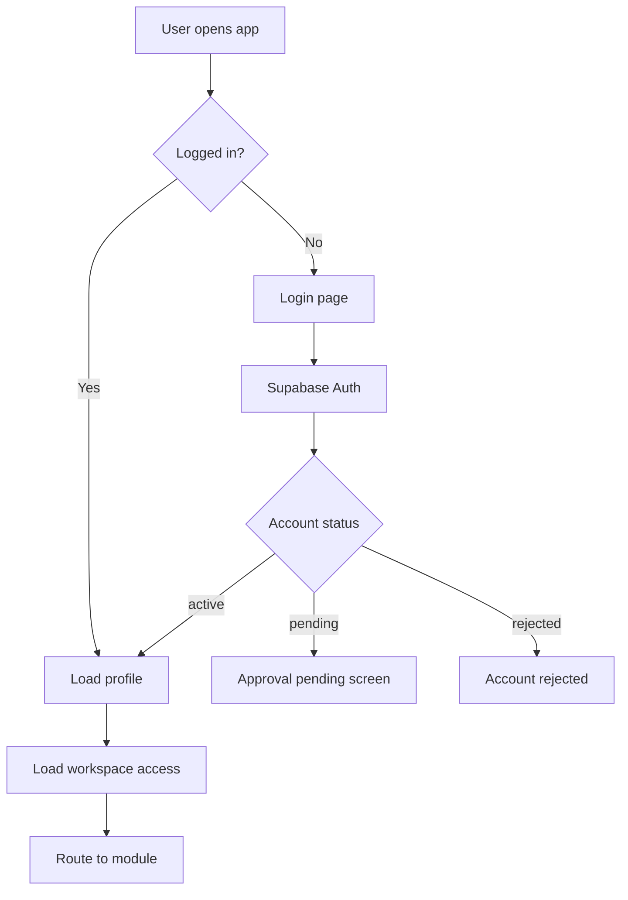

# Authentication

> How does LabHub handle user authentication?

## Overview

LabHub uses Supabase Auth for authentication. Users sign up with email/password, and their profile is stored in the `profiles` table.

## Auth Flow



## User Lifecycle

1. **Signup** → Profile created with `status: 'pending'`
2. **Admin notified** → Push notification with approve/reject actions
3. **Admin approves** → Status changes to `'active'`, role assigned
4. **User logs in** → Full access to permitted modules

## Profile Structure

```typescript
interface Profile {
  id: string          // = auth.users.id
  email: string
  name: string
  role: 'viewer' | 'technician' | 'admin'
  status: 'active' | 'pending'
  is_super_admin: boolean
  workspace_ids: string[]
  app_access: Record<string, 'full' | 'read' | 'none'>
  notify_settings: Record<string, boolean>
  avatar: string
  banner: string
}
```

## Auth Context (`src/core/auth/AuthContext.tsx`)

Provides:
- `user` — Current authenticated user
- `profile` — User profile from `profiles` table
- `loading` — Auth state loading
- `signIn()` / `signUp()` / `signOut()`
- `isSuperAdmin` — Super admin check

## Guards

| Guard | Purpose |
|-------|---------|
| `AuthGuard` | Requires authenticated user |
| `AdminGuard` | Requires admin or super admin role |
| `AppGuard` | Checks module access (workspace enabled + user permission) |

## Related

- [Authorization](authorization.md)
- [Workspaces](../concepts/workspaces.md)
