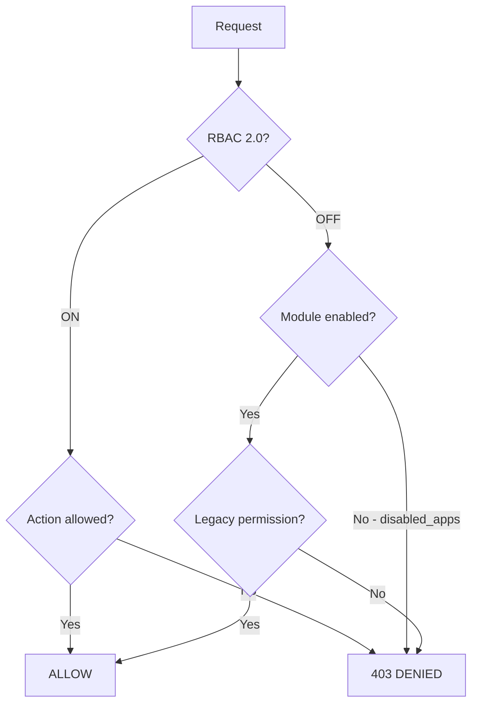

# Authorization

> How does LabHub control who can access what?

## Access Control Layers

LabHub has **four layers** of access control, checked in order:



1. **RBAC 2.0** (backend, when `RBAC_2_ENABLED=1`) — granular action-based authorization
2. **Module gate** — workspace `disabled_apps` check
3. **Legacy role** — `profiles.role` + `AppAccessLevel` (dash/read/full)
4. **RLS** — row-level security for workspace isolation (always active)

## RBAC 2.0

RBAC 2.0 is the **authoritative backend authorization layer**. When enabled (`RBAC_2_ENABLED=1`), every protected endpoint evaluates an **Action** against the user's **membership** in the current workspace.

### Decision Engine

```
super_admin   → ALLOW (all actions, all workspaces)
membership    → look up role in workspace
role_permissions → check if Action is granted for that role
overrides     → per-action allow/deny overrides the role base
default       → DENY (deny-by-default)
```

### Roles (migration 036)

| Slug | Name | Scope |
|------|------|-------|
| `tec` | Técnico | workspace |
| `vis` | Visualizador | workspace |
| `est` | Gestor de Estoque | workspace |
| `opv` | Operador TV | workspace |
| `adm` | Admin de Workspace | workspace |

Super Admin is **not a role** — it is the `profiles.is_super_admin` platform capability.

### How It Works

1. User authenticates → `require_auth` sets `g.user` (profile dict)
2. Decorator `require_action('ticket.view', scope='workspace')` or in-handler `_require_action_in_handler(...)` is called
3. Engine resolves: super_admin bypass → membership → role_permissions → overrides → deny
4. Decision is recorded in `rbac_audit_logs` (best-effort, append-only)
5. DENY → 403 "Permissão insuficiente"; ALLOW → proceed

### Protected Routes

| Route | Action | Scope |
|-------|--------|-------|
| `POST /api/tv/cloudinary/delete` | `tv.content.manage` | workspace |
| `POST /api/admin/wipe` | `admin.system.wipe` | global |
| `POST /api/admin/app-data/describe` | `admin.app.purge` | workspace |
| `POST /api/admin/app-data/purge` | `admin.app.purge` | workspace |
| `POST /api/chamados/reports/weekly-email` | `ticket.weeklyEmail` | global |
| `POST /api/admin/backups/prune` | `admin.backup.delete` | global |
| `POST /api/admin/backups/<id>/restore` | `admin.backup.restore` | global |
| `DELETE /api/admin/backups/<id>` | `admin.backup.delete` | global |
| `GET /api/admin/audit-logs` | `admin.audit.view` | global |
| `POST /api/admin/workspaces/<id>/delete` | `admin.workspace.delete` | global |
| `POST /api/push/send` | `reservelab.push.manage` | global |

### In-Handler Enforcement

Some routes resolve the workspace **after** fetching the resource (e.g., Chamados `<id>`). These use `_require_action_in_handler()` instead of the decorator:

| Route | Action |
|-------|--------|
| `GET /api/chamados/<id>` | `ticket.view` |
| `DELETE /api/chamados/<id>` | `ticket.delete` |
| `PATCH /api/chamados/<id>` | `ticket.status` / `ticket.assign` / `ticket.edit` (atomic) |
| `GET /api/chamados/<id>/events` | `ticket.view` |
| `POST /api/chamados/<id>/events` | `ticket.comment` |

### Feature Flag

```bash
RBAC_2_ENABLED=1   # ON — RBAC enforced, legacy still active as fallback
RBAC_2_ENABLED=0   # OFF — RBAC is a no-op, only legacy gates apply
```

When OFF, all decorators/helpers are no-ops. Existing behavior is preserved.

### Rollback

Setting `RBAC_2_ENABLED=0` immediately disables all RBAC enforcement. No code changes, no deploy needed.

## Legacy Role Hierarchy

The legacy model is preserved as a **fallback** when RBAC is OFF:

| Role | Description |
|------|-------------|
| `viewer` | Read-only access to assigned modules |
| `technician` | Can update tickets, manage assets |
| `admin` | Full access to all modules in workspace |
| `is_super_admin` | Bypasses all restrictions |

## App Access Overrides

Users can have per-module access overrides:

```json
{
  "reservalab": "full",
  "tv": "none",
  "chamados": "read"
}
```

Access levels:
- `full` — Complete access
- `read` — Read-only
- `none` — No access

## Workspace Filtering

### Database Level (RLS)

```sql
-- Every stock/pcare table uses this pattern (migration 027):
CREATE POLICY "{table}_select" ON schema.table FOR SELECT
  USING (
    is_super_admin()
    OR user_belongs_to_workspace(workspace_id)
  );
-- INSERT/UPDATE/DELETE follow the same pattern
-- NULL workspace_id = legacy records, visible to all
```

Function `user_belongs_to_workspace()` has two overloads (text, uuid) to match column types across schemas.

### Frontend Level

```typescript
// workspaceStore.filter() applies workspace filtering on local data
workspaceStore.filter(items) // returns only items for active workspace
```

### Backend Level

```python
# require_module() checks workspace.disabled_apps before operations
def require_module(workspace_id, module_id):
    # Returns 403 MODULE_DISABLED if module is in disabled_apps
```

## Notification Targeting

Push notifications respect workspace and role scoping:
- By module: `module: 'chamados'`
- By workspace: `workspace_id: '...'`
- By role: `role: 'admin'`
- By user: `userId: '...'`

## Related

- [Authentication](authentication.md)
- [Workspaces](../concepts/workspaces.md)
- [RBAC 2.0 Specification](rbac2.0-specification.md)
- [RBAC 2.0 Actions Catalog](rbac2.0-actions-catalog.md)
- [RBAC 2.0 Activation](rbac2.0-etapa7-activation.md)
