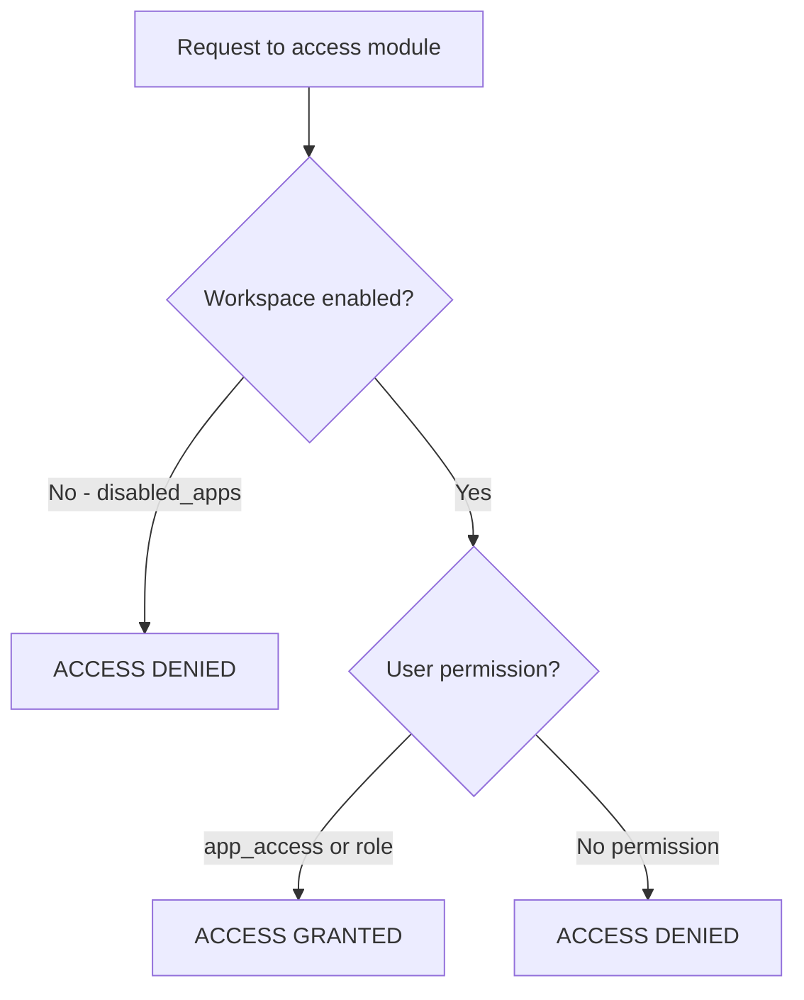

# Authorization

> How does LabHub control who can access what?

## Three-Layer Access Control

Module access follows three layers, checked in order:



**Important:** Workspace disabled ALWAYS wins. A user with `full` access to a module cannot use it if the module is disabled at the workspace level.

## Role Hierarchy

| Role | Description |
|------|-------------|
| `viewer` | Read-only access to assigned modules |
| `technician` | Can update tickets, manage assets |
| `admin` | Full access to all modules in workspace |
| `is_super_admin` | Bypasses all restrictions |

## App Access Overrides

Users can have per-module access overrides:

```json
{
  "reservalab": "full",
  "tv": "none",
  "chamados": "read"
}
```

Access levels:
- `full` — Complete access
- `read` — Read-only
- `none` — No access

## Workspace Filtering

### Database Level (RLS)
```sql
-- Every table with workspace_id has this pattern:
workspace_id IN (
  SELECT unnest(workspace_ids)
  FROM profiles
  WHERE id = auth.uid()
)
```

### Frontend Level
```typescript
// workspaceStore.filter() applies workspace filtering on local data
workspaceStore.filter(items) // returns only items for active workspace
```

### Backend Level
```python
# require_module() checks workspace.disabled_apps before operations
def require_module(workspace_id, module_id):
    # Returns 403 MODULE_DISABLED if module is in disabled_apps
```

## Permission Checks in Code

### Frontend
```typescript
const { isFullAccess } = useAppAccess()
const canWrite = isFullAccess('chamados')
```

### Backend
```python
@app.route('/api/chamados', methods=['POST'])
def create_ticket():
    if require_module(workspace_id, 'chamados'):
        return {'error': 'MODULE_DISABLED'}, 403
```

## Notification Targeting

Push notifications respect workspace and role scoping:
- By module: `module: 'chamados'`
- By workspace: `workspace_id: '...'`
- By role: `role: 'admin'`
- By user: `userId: '...'`

## Related

- [Authentication](authentication.md)
- [Workspaces](../concepts/workspaces.md)
