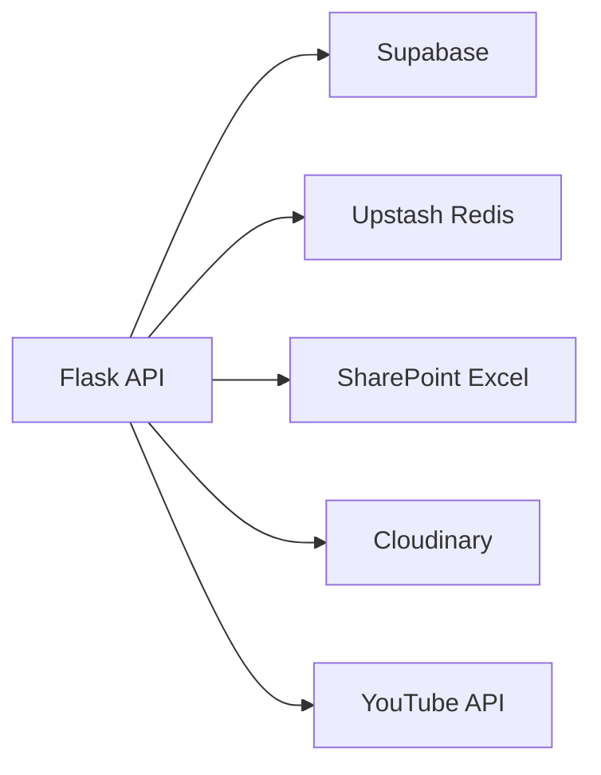

# Backend Architecture

> How does the Flask API work?

## Overview

LabHub uses a Flask (Python) backend deployed as Vercel Serverless Functions. The backend handles:
- Chamados ticket management
- Push notifications (Web Push via VAPID)
- ReservaLab data (SharePoint Excel integration)
- TV YouTube integration
- User approval workflows

## Entry Point

```
api/app.py (Vercel entry point)
    ↓ imports
src/apps/reservalab/api/app.py (main Flask app)
```

All `/api/*` routes are defined in `src/apps/reservalab/api/app.py`.

## Route Groups

### Chamados (`/api/chamados*`)
| Method | Route | Purpose |
|--------|-------|---------|
| POST | `/api/chamados` | Create ticket (public form) |
| GET | `/api/chamados` | List tickets with filters |
| GET | `/api/chamados/:id` | Get ticket detail |
| PATCH | `/api/chamados/:id` | Update ticket |
| POST | `/api/chamados/:id/feedback` | Submit rating (public) |
| GET | `/api/chamados/reports` | Aggregated reports |
| POST | `/api/chamados/workspaces` | List available campuses |

### Push Notifications (`/api/push/*`)
| Method | Route | Purpose |
|--------|-------|---------|
| POST | `/api/push/subscribe` | Register push subscription |
| GET | `/api/push/test` | Send test notification |
| POST | `/api/push/send` | Send segmented push |
| POST | `/api/push/action` | Handle notification actions (approve/reject) |
| GET | `/api/push/check` | Cron: upcoming reservations |
| GET | `/api/push/check-overdue` | Cron: overdue loans |
| GET | `/api/push/check-pcare` | Cron: PCare alerts |
| GET | `/api/push/check-all` | Cron: all checks aggregated |

### ReservaLab (`/api/reservas`)
| Method | Route | Purpose |
|--------|-------|---------|
| GET | `/api/reservas` | Lab reservations from SharePoint |
| GET | `/api/health` | Server status |

### TV (`/api/tv/*`)
| Method | Route | Purpose |
|--------|-------|---------|
| POST | `/api/tv/youtube/fetch` | Fetch YouTube metadata |
| GET | `/api/tv/health` | Server status |

## Security

- **RLS bypass**: Uses `SUPABASE_SERVICE_KEY` to access data that requires elevated permissions
- **CORS**: Enabled for the frontend domain
- **Cron protection**: `/api/push/check*` endpoints require `CRON_SECRET` in Authorization header
- **Input validation**: All endpoints validate required fields before processing
- **Module disabled check**: `require_module()` verifies workspace has Chamados enabled before creating tickets

## External Integrations



| Service | Purpose |
|---------|---------|
| Supabase | Primary database (service_role access) |
| Upstash Redis | Push subscriber storage, dedup cache, reservation cache |
| SharePoint Excel | ReservaLab reservation data (read-only) |
| Cloudinary | Photo uploads (chamados, PCare) |
| YouTube API | Video metadata for TV playlists |

## Environment Variables

| Variable | Required | Purpose |
|----------|----------|---------|
| `SUPABASE_URL` | Yes | Supabase project URL |
| `SUPABASE_SERVICE_KEY` | Yes | Service role key (bypasses RLS) |
| `UPSTASH_REDIS_REST_URL` | No | Redis for push + cache |
| `UPSTASH_REDIS_REST_TOKEN` | No | Redis auth token |
| `VAPID_PUBLIC_KEY` | No | Web Push public key |
| `VAPID_PRIVATE_KEY` | No | Web Push private key |
| `CRON_SECRET` | Yes (crons) | Protects cron endpoints |
| `YOUTUBE_API_KEY` | Yes (TV) | YouTube Data API v3 |
| `SHAREPOINT_URL` | No (legacy) | Fallback reservation spreadsheet |

## Deployment

- Deployed automatically on push to `main` via Vercel
- Python Serverless Functions with cold start
- Cron jobs configured in `.github/workflows/push-cron.yml`

## Related

- [System Architecture](system.md)
- [Guides: Deployment](../guides/deployment.md)
- [Reference: API](../reference/api.md)
