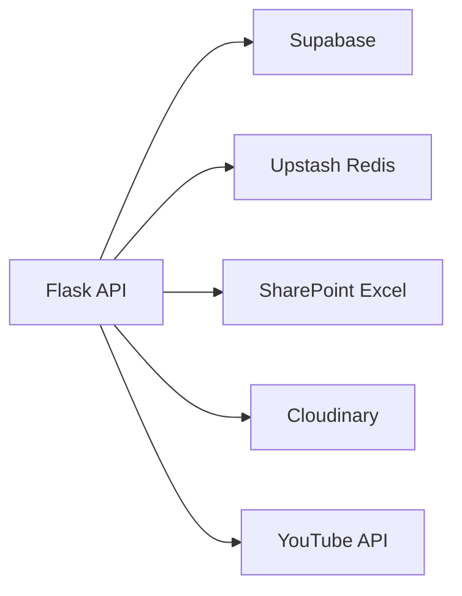

# Backend Architecture

> How does the Flask API work?

## Overview

LabHub uses a Flask (Python) backend deployed as Vercel Serverless Functions. The backend handles:
- Chamados ticket management
- Push notifications (Web Push via VAPID)
- ReservaLab data (SharePoint Excel integration)
- TV YouTube integration
- User approval workflows
- **RBAC 2.0 authorization** (action-based, deny-by-default)

## Entry Point

```
api/app.py (Vercel entry point)
    ↓ imports
src/apps/reservalab/api/app.py (main Flask app)
```

All `/api/*` routes are defined in `src/apps/reservalab/api/app.py`.

## Route Groups

### Chamados (`/api/chamados*`)

| Method | Route | Purpose | RBAC Action |
|--------|-------|---------|-------------|
| POST | `/api/chamados` | Create ticket (public form) | — |
| GET | `/api/chamados` | List tickets with filters | — (legacy) |
| GET | `/api/chamados/:id` | Get ticket detail | `ticket.view` |
| PATCH | `/api/chamados/:id` | Update ticket | `ticket.status` / `ticket.assign` / `ticket.edit` |
| DELETE | `/api/chamados/:id` | Delete ticket | `ticket.delete` |
| GET | `/api/chamados/:id/events` | Ticket timeline | `ticket.view` |
| POST | `/api/chamados/:id/events` | Add comment | `ticket.comment` |
| POST | `/api/chamados/:id/feedback` | Submit rating (public) | — |
| GET | `/api/chamados/reports` | Aggregated reports | — (legacy) |
| POST | `/api/chamados/reports/weekly-email` | Send weekly summary | `ticket.weeklyEmail` (global) |
| POST | `/api/chamados/workspaces` | List available campuses | — |
| POST | `/api/chamados/photos/purge` | Clean orphan photos | — |

### Push Notifications (`/api/push/*`)

| Method | Route | Purpose | RBAC Action |
|--------|-------|---------|-------------|
| POST | `/api/push/subscribe` | Register push subscription | — |
| GET | `/api/push/test` | Send test notification | — (legacy) |
| POST | `/api/push/send` | Send segmented push | `reservelab.push.manage` (global) |
| POST | `/api/push/action` | Handle notification actions | — (legacy) |
| GET | `/api/push/check` | Cron: upcoming reservations | — (cron) |
| GET | `/api/push/check-overdue` | Cron: overdue loans | — (cron) |
| GET | `/api/push/check-pcare` | Cron: PCare alerts | — (cron) |
| GET | `/api/push/check-all` | Cron: all checks aggregated | — (cron) |

### Admin (`/api/admin/*`)

| Method | Route | Purpose | RBAC Action |
|--------|-------|---------|-------------|
| POST | `/api/admin/wipe` | Wipe operational data | `admin.system.wipe` (global) |
| POST | `/api/admin/app-data/describe` | Describe app data | `admin.app.purge` (workspace) |
| POST | `/api/admin/app-data/purge` | Purge app data | `admin.app.purge` (workspace) |
| GET | `/api/admin/audit-logs` | List RBAC audit logs | `admin.audit.view` (global) |
| POST | `/api/admin/backups` | List backups | — (require_admin) |
| POST | `/api/admin/backups/prune` | Delete expired backups | `admin.backup.delete` (global) |
| POST | `/api/admin/backups/:id/restore` | Restore backup | `admin.backup.restore` (global) |
| DELETE | `/api/admin/backups/:id` | Delete backup | `admin.backup.delete` (global) |
| POST | `/api/admin/workspaces/:id/delete` | Delete workspace | `admin.workspace.delete` (global) |

### TV (`/api/tv/*`)

| Method | Route | Purpose | RBAC Action |
|--------|-------|---------|-------------|
| POST | `/api/tv/youtube/fetch` | Fetch YouTube metadata | — |
| POST | `/api/tv/youtube/search` | Search YouTube | — |
| POST | `/api/tv/calendar/extract` | Extract calendar events | — |
| POST | `/api/tv/source/fetch` | Fetch TV source | — |
| GET | `/api/tv/youtube/live` | YouTube live status | — |
| POST | `/api/tv/cloudinary/delete` | Delete TV image | `tv.content.manage` (workspace) |
| GET | `/api/tv/health` | Server status | — |
| POST | `/api/tv/activation/create` | Create activation code | — |
| POST | `/api/tv/activation/redeem` | Redeem activation code | — |
| POST | `/api/tv/devices/provision` | Provision device | — |
| GET | `/api/tv/chamados/display` | Display tickets on TV | — |

### ReservaLab (`/api/reservas`)

| Method | Route | Purpose |
|--------|-------|---------|
| GET | `/api/reservas` | Lab reservations from SharePoint |
| GET | `/api/health` | Server status |

### Public (no auth)

| Method | Route | Purpose |
|--------|-------|---------|
| GET | `/api/public/chamados/:tracking_token` | Public ticket view |
| GET | `/api/public/chamados/:tracking_token/events` | Public ticket events |
| POST | `/api/public/chamados/:tracking_token/feedback` | Public feedback |
| POST | `/api/public/chamados/:tracking_token/subscribe` | Public subscribe |

## RBAC 2.0 Enforcement

Two mechanisms protect routes:

### Decorator (`require_action_rbac`)

Applied at the route level for endpoints where the workspace is known upfront:

```python
@app.route('/api/admin/wipe', methods=['POST'])
@require_auth
@require_admin
@require_action_rbac('admin.system.wipe', scope='global')
def admin_wipe():
    ...
```

### In-Handler (`_require_action_in_handler`)

Used for routes where the workspace is resolved **after** fetching the resource:

```python
g.workspace_id = ticket_ws  # workspace derived from resource
err = _require_action_in_handler('ticket.view', scope='workspace',
                                  resource_type='ticket', resource_id=ticket_id)
if err:
    return err
```

### Fail-Closed

Both mechanisms are **fail-closed**: any error in the authorization engine results in DENY, never ALLOW.

## Security

- **RBAC 2.0**: Action-based authorization (when `RBAC_2_ENABLED=1`)
- **RLS bypass**: Uses `SUPABASE_SERVICE_KEY` to access data that requires elevated permissions
- **CORS**: Enabled for the frontend domain
- **Cron protection**: `/api/push/check*` endpoints require `CRON_SECRET` in Authorization header
- **Input validation**: All endpoints validate required fields before processing
- **Module disabled check**: `require_module()` verifies workspace has module enabled
- **Workspace isolation**: `require_workspace()` validates user belongs to the workspace

## External Integrations



| Service | Purpose |
|---------|---------|
| Supabase | Primary database (service_role access) |
| Upstash Redis | Push subscriber storage, dedup cache, reservation cache |
| SharePoint Excel | ReservaLab reservation data (read-only) |
| Cloudinary | Photo uploads (chamados, PCare) |
| YouTube API | Video metadata for TV playlists |

## Environment Variables

| Variable | Required | Purpose |
|----------|----------|---------|
| `SUPABASE_URL` | Yes | Supabase project URL |
| `SUPABASE_SERVICE_KEY` | Yes | Service role key (bypasses RLS) |
| `RBAC_2_ENABLED` | No | Enable RBAC 2.0 enforcement (`1` = ON) |
| `UPSTASH_REDIS_REST_URL` | No | Redis for push + cache |
| `UPSTASH_REDIS_REST_TOKEN` | No | Redis auth token |
| `VAPID_PUBLIC_KEY` | No | Web Push public key |
| `VAPID_PRIVATE_KEY` | No | Web Push private key |
| `CRON_SECRET` | Yes (crons) | Protects cron endpoints |
| `YOUTUBE_API_KEY` | Yes (TV) | YouTube Data API v3 |
| `SHAREPOINT_URL` | No (legacy) | Fallback reservation spreadsheet |

## Deployment

- Deployed automatically on push to `main` via Vercel
- Python Serverless Functions with cold start
- Cron jobs configured in `.github/workflows/push-cron.yml`

## Related

- [System Architecture](system.md)
- [Authorization](authorization.md)
- [RBAC 2.0 Actions Catalog](rbac2.0-actions-catalog.md)
- [Guides: Deployment](../guides/deployment.md)
- [Reference: API](../reference/api.md)
