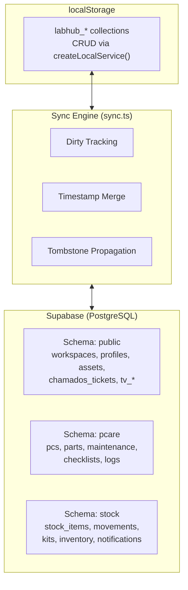

# Data Layer

> How does LabHub manage data across local and remote storage?

## Three-tier Architecture



## localStorage (Local Source of Truth)

### Structure
- Prefix: `labhub_`
- Each collection is a JSON array stored as a string
- Access via `getCol<T>(collection)` / `setCol(collection, items)`

### Service Layer
```typescript
createLocalService<T>(collection) → {
  getAll(), getById(), create(), update(), remove(), query()
}
```

### Sync-aware Service Layer
```typescript
createSyncService<T>(collection) → {
  // Same API as createLocalService
  // Plus: marks collections dirty on write
  // Plus: tracks deletions for remote propagation
}
```

## Supabase (Remote Database)

### Schemas
| Schema | Tables | Access Pattern |
|--------|--------|---------------|
| `public` | workspaces, profiles, assets, chamados_tickets, tv_*, tablet_reservations | RLS + service_role |
| `pcare` | pcs, parts, part_usage, maintenance, checklists, logs | Sync engine |
| `stock` | stock_items, movements, kits, inventory, notifications | Sync engine |

### Row Level Security (RLS)
All tables have RLS enabled. Policies filter by workspace membership:
```sql
workspace_id IN (
  SELECT unnest(workspace_ids)
  FROM profiles
  WHERE id = auth.uid()
)
```

### Exception: Chamados
`chamados_tickets` has `REVOKE ALL FROM anon, authenticated` — only the Flask API (service_role) can access it.

## Data Access Patterns

### Pattern 1: Direct Supabase (Global Assets)
```
Component → useAssets() → global-repository.ts → Supabase (RLS)
```

### Pattern 2: Sync Engine (PCare, Stock)
```
Component → pcService → createSyncService → localStorage + dirty flag
                                                   ↓
                                          syncAll() → Supabase
```

### Pattern 3: Flask API (Chamados)
```
Component → ticketService → fetch('/api/chamados') → Flask → Supabase
```

### Pattern 4: External Source (ReservaLab)
```
Component → fetch('/api/reservas') → Flask → SharePoint Excel
```

## Local-only Collections

These collections have no remote table and exist only in localStorage:
- `assets` (legacy PCare assets)
- `chamados` (local cache, not used for writes)
- `rooms`, `problem_templates`, `sla_configs`
- `audit_logs`, `user_profiles`, `roles`

## Related

- [Synchronization](../concepts/synchronization.md)
- [Offline-first](../concepts/offline-first.md)
- [Reference: Database](../reference/database.md)
