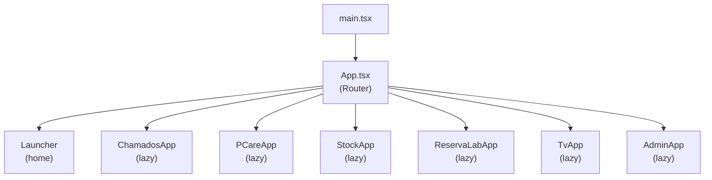

# Frontend Architecture

> How is the React frontend structured?

## Technology Stack

- **React 19** with TypeScript 6
- **Vite 8** for build tooling
- **Tailwind CSS v4** for styling
- **Radix UI** for accessible primitives
- **Framer Motion** for animations
- **React Router** for routing
- **Vitest + Testing Library** for tests

## Application Structure

All sub-apps are lazy-loaded via `React.lazy()`, keeping the initial bundle minimal.

## Layout System

Each module has its own layout with navigation:
- **Desktop**: Sidebar navigation
- **Mobile**: Bottom navigation bar
- **Kiosk mode**: Simplified for tablets

Layouts wrap their pages and provide:
- Active workspace indicator
- Sync status badge
- Notification bell
- Theme toggle

## Context Providers

| Context | Scope | Purpose |
|---------|-------|---------|
| `ThemeContext` | Per-module | Dark/light theme with localStorage persistence |
| `ToastContext` | Global | In-app notifications |
| `TicketsContext` | Chamados | Ticket state and operations |
| `AuthContext` | Global | User authentication state |
| `WorkspaceContext` | Global | Active workspace and workspace list |

## Component Patterns

### UI Components (`src/lib/components/ui/`)
Radix-based primitives: Button, Dialog, Popover, Select, Tabs, etc.

### Chart Components (`src/lib/charts/`)
Recharts wrappers: BarChart, DonutChart, ChartCard.

### Module Components
Each module owns its components in `src/apps/<module>/components/`.

## Hooks

### Global Hooks (`src/lib/`)
| Hook | Purpose |
|------|---------|
| `useOnlineSync` | Manages sync lifecycle |
| `useRealtimeSubscription` | Supabase Realtime subscriptions |
| `useRealtimePresence` | User presence tracking |
| `useRealtimeBroadcast` | Cross-tab communication |
| `usePushNotifications` | Web Push subscription |
| `useLabContext` | Active lab context |
| `useKioskMode` | Tablet kiosk mode |
| `useMediaQuery` | Responsive breakpoints |
| `useNavigateWithTransition` | View Transitions API |

### Module Hooks
Each module has domain-specific hooks in `src/apps/<module>/hooks/`.

## Error Handling

- `ErrorBoundary` component wraps each module
- API errors display inline (never `alert()`)
- Sync failures are logged and retried

## Testing

- Unit tests: `src/apps/<module>/pages/__tests__/`
- Test setup: `src/test/setup.ts`
- Mocks: `src/test/mocks.ts`
- Helpers: `src/test/helpers.tsx`

## Related

- [System Architecture](system.md)
- [Data Layer](data-layer.md)
- [Guides: Development](../guides/development.md)
