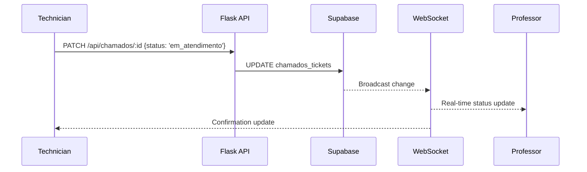

# Realtime

> How does LabHub provide instant updates?

## What

LabHub uses Supabase Realtime (WebSocket connections) to push data changes to connected clients without polling. This is primarily used in the Chamados module for instant ticket status updates.

## How It Works

### Subscription Pattern

```typescript
useRealtimeSubscription<TableType>(
  'table_name',           // Supabase table
  '*',                    // Event type: INSERT, UPDATE, DELETE, or *
  (payload) => { ... },   // Callback with new/old data
  {
    channelName: 'unique:channel:name',
    enabled: boolean,     // Condition to subscribe
  }
)
```

### Chamados Realtime Flow



### Broadcast Channel

For cross-tab communication (e.g., same user on multiple browser tabs):

```typescript
useRealtimeBroadcast(channelName, {
  onBroadcast: (event) => { ... }
})

// Send
broadcast({ event: 'ticket_updated', payload: data })
```

### Presence

Track which users are currently viewing a ticket:

```typescript
useRealtimePresence(channelName, {
  user: { id, name, avatar }
})
```

## Polling Fallback

When Realtime is unavailable (offline, unsupported browser):
- 15-second polling interval for critical data
- 60-second interval for dashboard stats
- Manual refresh on user action

## Channel Naming Convention

```
chamados:public:{ticketId}   — ticket-specific updates
chamados:workspace:{wsId}    — workspace-wide ticket updates
presence:{context}           — user presence tracking
```

## Performance Considerations

- Each subscription creates a WebSocket connection
- Channels are scoped to specific tables/filters
- Subscriptions auto-cleanup on component unmount
- `enabled` flag prevents unnecessary connections

## Related

- [Synchronization](../concepts/synchronization.md)
- [Architecture: System](system.md)
