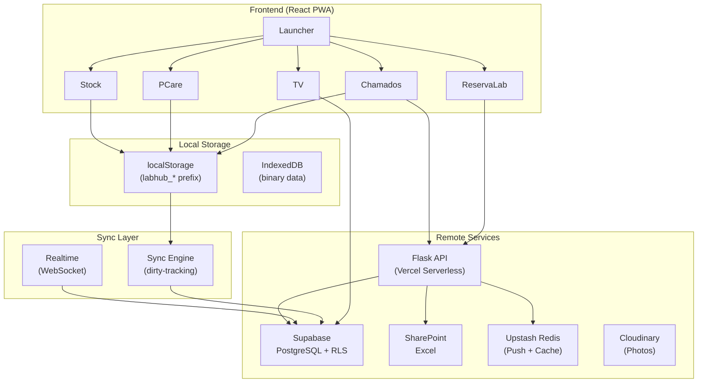

# System Architecture

> How does the LabHub system work as a whole?

## High-level Architecture



## Data Flow Patterns

### Pattern 1: Local-first with sync (PCare, Stock)
```
Component → Service → localStorage → Sync Engine → Supabase
```

### Pattern 2: API-mediated (Chamados)
```
Component → ticketService → Flask API → Supabase
                                  ↓
                          Push notification → Upstash → Browser
```

### Pattern 3: Direct remote (TV, ReservaLab tablets)
```
Component → Supabase client → Supabase (RLS-filtered)
```

### Pattern 4: External data source (ReservaLab labs)
```
Component → Flask API → SharePoint Excel → Cache (Redis/file)
```

## Request Lifecycle

### Creating a Ticket (Chamados)
1. User fills form at `/chamados-publico`
2. `ticketService.create()` sends POST to `/api/chamados`
3. Flask validates, generates sequential `ticketNumber`
4. Inserts into `chamados_tickets` (Supabase)
5. Triggers push notification to TI team
6. Returns ticket to frontend
7. Realtime pushes status updates to professor

### Updating Stock (Offline-first)
1. User edits item in Stock UI
2. `stockService.update()` writes to localStorage
3. Collection marked dirty in `labhub_dirty_collections`
4. Sync engine pushes to Supabase on next cycle
5. Other devices pull changes on their next sync

## Key Design Decisions

- **localStorage over IndexedDB for primary data** — simpler API, synchronous access, sufficient for most data
- **Flask for Chamados API** — bypasses RLS restrictions, enables push notifications
- **RLS for Global Assets** — direct Supabase access with workspace isolation
- **Lazy loading per module** — each sub-app is a separate chunk, loaded on demand

## Related

- [Frontend Architecture](frontend.md)
- [Backend Architecture](backend.md)
- [Data Layer](data-layer.md)
