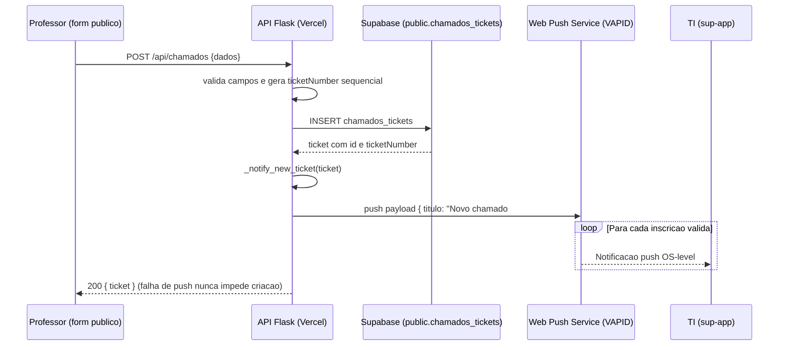
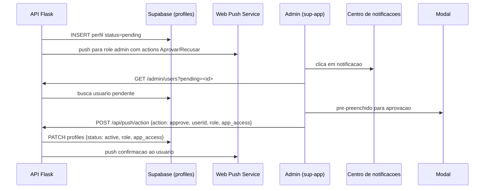

# Chamados — Gestão de Chamados e Ordens de Serviço

> Sub-app para gestão de chamados técnicos, aprovação de usuários e relatórios de SLA.

**Rota:** `/chamados` (TI) e `/chamados-publico` (formulário público via QR)  
**Cor:** `#f59e0b` (amber)

---

## Visão Geral

O módulo **Chamados** centraliza todas as ordens de serviço e solicitações de suporte técnico em laboratórios de informática. Ele integra:

- Formulário público para professores (via QR code ou link)
- Painel de gestão para equipe de TI
- Sistema de aprovação de cadastros e permissões
- Controle de SLA por prioridade
- Notificações push automáticas
- Histórico completo com comentários e anexos

---

## Rotas (Frontend)

| Rota | Pagina | Descricao |
|------|--------|-----------|
| `/chamados` | ChamadosLayout | Painel do TI (apenas admin/supervisor) |
| `/chamados/tickets` | TicketList | Lista de todos os chamados com filtros |
| `/chamados/tickets/:id` | TicketDetail | Detalhe de um chamado específico |
| `/chamados/publico` | ChamadosPublico | Formulário público para abertura de chamado |
| `/chamados/publico/success/:id` | TicketSuccess | Página de sucesso após abertura |
| `/admin/users` | UsersPage | Gestão de usuários (aprovacao, roles, workspaces) |
| `/admin/backups` | BackupsPage | Backup e restauracao de workspaces |

---

## Funcionalidades Principais

### 1. Formulário Publico (`/chamados/publico`)

- Aberto a qualquer professor (sem login obrigatório)
- Selecao de campus (workspace), sala, categoria do problema
- Upload de fotos (Cloudinary, maximo 600KB)
- Geração automática de `ticketNumber` sequencial por workspace
- Gravacao no Supabase via API `POST /api/chamados`
- Disparo immediato de push para a equipe TI (`_notify_new_ticket`)

### 2. Painel TI (`/chamados/tickets`)

- Lista filtrada por status, prioridade, campus, responsavel
- Busca por nome do professor ou numero do chamado
- Acoes: atualizar status, atribuir tecnico, adicionar comentarios, arquivar
- Push de status para professor quando chamado e atualizado
- Filtros por: `aberto`, `a_caminho`, `em_atendimento`, `resolvido`, `fechado`
- Filtros por prioridade: `baixa`, `normal`, `alta`, `urgente`

### 3. Aprovacao de Usuarios

- Novo usuario se cadastra com status `pending`
- Push imediato para role `admin` com acoes Aprovar/Recusar
- Admin escolhe cargo (`viewer`, `technician`, `admin`) e overrides por app
- Aprovacao via `POST /api/push/action` ou deep link direto
- Notificacao local (sino) com dedupe por actionUrl

### 4. SLA e Relatorios

- Prazos por prioridade (definidos em `CHAMADOS_PRIORITIES`)
- Dashboard de cumplimento de SLA
- Relatorios por periodo, tecnico,area, sala
- Exportacao em CSV, XLSX e PDF
- Agugregacao por tecnico: total, abertos, resolvidos, tempo medio, rating medio

### 5. Historico e Comentarios

- Cada chamado tem historico de eventos (status changes, comentarios)
- Comentarios podem ter fotos (Cloudinary)
- Cada evento tem autor, conteudo e timestamp
- Notificacao ao professor quando status ou mensagem muda

---

## API Endpoints

### POST /api/chamados

Cria um chamado a partir do formulário público.

**Body:**
```json
{
  "workspace_id": "uuid-do-campus",
  "roomName": "Sala 201",
  "roomId": "optional",
  "reportedBy": "Nome do professor",
  "problemCategory": "hardware",
  "problemArea": "administrativa",
  "problemDescription": "O computador nao liga",
  "priority": "normal",
  "photos": "base64 ou url do Cloudinary"
}
```

**Resposta:** Objeto do chamado criado com `ticketNumber` gerado sequencialmente.

### GET /api/chamados

Lista chamados com filtros opcionais: `workspace_id`, `status`, `reportedBy`.

### GET /api/chamados/:id

Busca um chamado especifico por ID.

### PATCH /api/chamados/:id

Atualiza status, responsavel, prioridade, arquivamento, fotos, statusNote.

### GET /api/chamados/reports

Relatorio aggregado no servidor com metricas:
- total, por status/prioridade/categoria/area/sala
- por tecnico (open, resolved, avg resolution time, rating)
- feedback count e average

### POST /api/chamados/workspaces

Lista os campi (workspaces) disponiveis para o formulário público.

---

## Fluxo: Notificacao de Chamado Novo



### Fluxo: Aprovacao de Usuario Pendente



---

## Variaveis de Ambiente (Backend)

| Variavel | Obrigatorio | Descricao |
|----------|-------------|-----------|
| `SUPABASE_URL` | Sim | URL do Supabase |
| `SUPABASE_SERVICE_KEY` | Sim | Service key para operacoes com RLS bloqueado |
| `UPSTASH_REDIS_REST_URL` | Nao | URL do Upstash Redis (push) |
| `UPSTASH_REDIS_REST_TOKEN` | Nao | Token do Upstash Redis |
| `VAPID_PUBLIC_KEY` | Nao | Chave publica Web Push |
| `VAPID_PRIVATE_KEY` | Nao | Chave privada Web Push |
| `CRON_SECRET` | Nao | Protege endpoints de cron (opcional) |

---

## Tipos TypeScript (Resumido)

```typescript
interface ChamadoTicket {
  id: string
  workspace_id: string
  roomId: string
  roomName: string
  assetId: string
  assetSource: 'stock' | 'pcare'
  assetName: string
  assetPatrimony: string
  problemCategory: string
  problemArea: 'administrativa' | 'academica'
  problemDescription: string
  status: 'aberto' | 'a_caminho' | 'em_atendimento' | 'resolvido' | 'fechado'
  priority: 'baixa' | 'normal' | 'alta' | 'urgente'
  reportedBy: string
  reportedByEmail: string
  assignedTo: string
  assignedToUserId: string
  ticketNumber: number
  photos: string[]
  ticketNumber: integer
  createdAt: string
  updatedAt: string
  resolvedAt: string | null
  closedAt: string | null
  closedBy: string
  statusNote: string
  archived: boolean
}

interface ChamadoForm {
  workspace_id: string
  roomName: string
  roomId?: string
  reportedBy: string
  problemCategory: string
  problemArea: 'administrativa' | 'academica'
  problemDescription: string
  priority: 'baixa' | 'normal' | 'alta' | 'urgente'
  photos?: string
}
```

---

## Dados Locais (localStorage)

| Chave | Conteudo |
|-------|----------|
| `labhub_chamados` | Lista de chamados (local-only no sync) |
| `labhub_chamado_<id>` | Dados do chamado individual |

> **Nota:** A colecao `chamados` e **local-only** no motor de sync — o acesso e feito exclusivamente via API `ticketService` (`/api/chamados`), pois a tabela `chamados_tickets` tem RLS bloqueado para anon/authenticated (só service_role acessa).

---

## Componentes

| Componente | Descricao |
|------------|-----------|
| `TicketCard` | Card de chamado com status e acoes rapidas |
| `TicketForm` | Formulario de cadastro/edicao (publico ou TI) |
| `StatusBadge` | Badge de status colorido (aberto, a caminho, etc) |
| `PriorityBadge` | Badge de prioridade (baixa, normal, alta, urgente) |
| `AssignmentBadge` | Badge de responsavel atribuido |
| `CommentItem` | Item de historico de comentarios |
| `AttachmentPreview` | Preview de fotos anexadas |
| `BatchActionBar` | Barra de acoes em lote (arquivar, atribuir, etc) |
| `SLAStatus` | Indicador visual de cumprimento de SLA |
| `ReportExporter` | Exportador para CSV/XLSX/PDF |

---

## Hooks

| Hook | Descricao |
|------|-----------|
| `useTickets` | CRUD e estado dos chamados |
| `useTicket` | Dados de um chamado especifico |
| `useTicketForm` | Estado do formulario de chamado |
| `useSLAConfig` | Configuracao de prazos por prioridade |
| `useNotifications` | Estado de inscricao e envio de push |
| `useAdminUsers` | Estado da pagina de gestao de usuarios |

---

## Servicos

| Servico | Descricao |
|---------|-----------|
| `ticketService` | CRUD e sync de chamados (via API) |
| `notificationService` | Gestao de inscricoes push e envios |
| `adminService` | Operacoes de aprovacao e gestao de usuarios |
| `reportService` | Generacao de relatorios e exportacoes |

---

## Isolamento do Modulo

O modulo Chamados funciona de forma **independente** dos demais subapps (PCare, Estoque, ReservaLab, TV). Um workspace pode possuir apenas Chamados habilitado.

**O que e permitido:**
- Criar, listar, visualizar, alterar, comentar e fechar chamados sem PCare ou Estoque.
- Chamados sem assetId/assetSource funcionam normalmente.
- Tickets antigos com `assetSource: 'pcare'` ou `assetSource: 'stock'` continuam sendo exibidos.

**O que e opcional (integração):**
- `useRoomAssets` busca equipamentos via `core/assets/service`; se o servico falhar (modulos de origem indisponiveis), retorna lista vazia.
- O campo `assetSource` e um label de integração — nao gera dependencia funcional.

**Dependencias do modulo:**
- `core/*` (auth, permissions, workspaces, users, logs, notifications) — infraestrutura global.
- `lib/*` (sync, db, icons, charts, hooks) — infraestrutura global.
- `core/assets/service` — consumido por `useRoomAssets` com fallback seguro.
- Nao ha imports de `src/apps/pcare`, `src/apps/stock`, `src/apps/reservalab` ou `src/apps/tv`.

---

## Seguranca e RLS

- **`chamados_tickets`**: `ENABLE ROW LEVEL SECURITY` + `REVOKE ALL ... FROM anon, authenticated, PUBLIC` — somente o backend (service_role) lê/escreve.
- **Endpoints API**: Todos os endpoints `/api/chamados*` exigem `SUPABASE_URL` e `SUPABASE_SERVICE_KEY`; sem elas retornam 503.
- **Push inscricoes**: Ficam no Upstash Redis (nao no Postgres); perfil de usuario (`notify_settings`) e respeitado totalmente.
- **Aprovacao**: Apenas super admins ou admins do workspace podem aprovar usuarios pendentes.

---

## Bugs Conhecidos (historico)

- Cache da planilha global cruzava campi -> corrigido com chave por workspace (Redis + arquivo)
- `useEffect` com deps vazias usava `workspace` stale -> corrigido com deps em cada pagina
- `alert()` nas validacoes -> substituido por erro inline
- Cards usavam indice do array como key -> substituido por chave estavel derivada do conteudo
- `getByDisplayValue` nao normaliza o matcher (testing-library) -> usar regex ou funcao
- Push admin usava `VITE_PUSH_API_URL` inexistente -> corrigido para `VITE_RESERVALAB_API_URL`