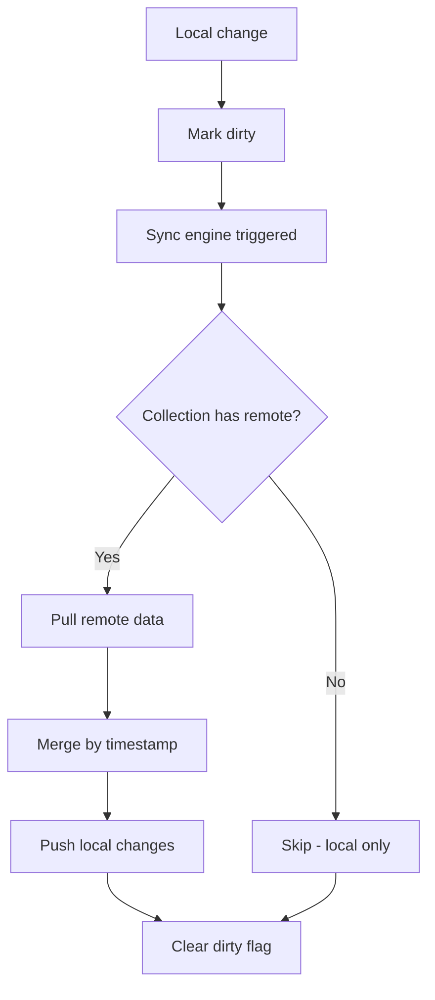

# Synchronization

> How does data flow between localStorage and Supabase?

## What

Synchronization is the process of merging local localStorage data with remote Supabase data. It uses dirty-tracking, timestamp-based merge, and tombstone propagation.

## Why

Multiple users and devices need to see the same data. When a technician updates a ticket on their phone, other team members should see the change. The sync engine ensures eventual consistency across all clients.

## Sync Engine (`src/lib/sync.ts`)

### Collections

Collections are divided into two categories:

**Remote-backed** (have Supabase tables):
| Collection | Schema |
|-----------|--------|
| `pcs`, `parts`, `part_usage`, `maintenance`, `checklist_templates`, `pc_checklists`, `action_logs` | pcare |
| `stock_items`, `stock_movements`, `stock_kits`, `stock_maintenance`, `inventory_cycles`, `inventory_counts`, `notifications` | stock |
| `workspaces`, `global_assets` | public |

**Local-only** (no remote table):
`assets`, `chamados`, `rooms`, `problem_templates`, `sla_configs`, `audit_logs`, `user_profiles`, `roles`

### Sync Flow



### Merge Strategy

- Compare `updatedAt` timestamps
- Newer version wins (no conflict resolution beyond timestamp)
- On first sync, only pull happens (local seed data is never pushed)

### Tombstone Propagation

When an item is deleted locally:
1. Its ID is added to `labhub_deleted_ids` in localStorage
2. On next sync, the ID is deleted from Supabase
3. After successful deletion, the tombstone is cleared

### Service Layer

`createSyncService<T>()` wraps `createLocalService<T>()` with sync capabilities:

```typescript
const pcService = createSyncService<PC>('pcs')

pcService.getAll()      // reads from localStorage
pcService.create(data)  // writes to localStorage + marks dirty
pcService.update(id, data)  // writes to localStorage + marks dirty
pcService.remove(id)    // removes locally + marks for remote deletion
```

## Realtime vs Polling

| Mechanism | Latency | Use Case |
|-----------|---------|----------|
| Supabase Realtime | ~100ms | Chamados ticket updates |
| Polling (15s) | 15s | Fallback for all collections |
| Manual sync | On-demand | User-triggered refresh |

## Related

- [Offline-first](offline-first.md)
- [Architecture: Data Layer](../architecture/data-layer.md)
- [Realtime](../architecture/realtime.md)
