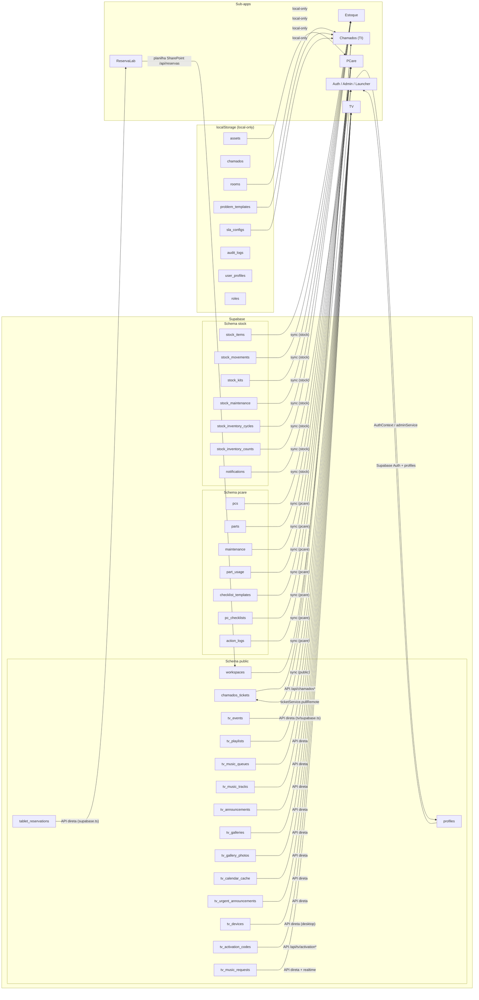

# Banco de Dados — LabHub

> Modelo de dados do Supabase (PostgreSQL) e como o aplicativo consome cada dado.
> Estrutura em 3 camadas: **Supabase (remoto)**, **engine de sync** e **localStorage (offline-first)**.

---

## Visão Geral do Modelo de Dados

O LabHub usa **um projeto Supabase** com **três schemas** e um cache local no navegador:

```
┌──────────────────────────────────────────────────────────────────────────┐
│  Supabase (PostgreSQL)                                                   │
│  ├─ public   → workspaces, profiles, chamados_tickets, tablet_reservations,
│  │             tv_* (eventos, playlists, músicas, galerias, avisos, TVs) │
│  ├─ pcare    → pcs, parts, maintenance, part_usage, checklists, logs     │
│  └─ stock    → stock_items, stock_movements, stock_kits, inventory,      │
│                notifications                                             │
├──────────────────────────────────────────────────────────────────────────┤
│  Engine de Sync (src/lib/sync.ts)                                        │
│  → push/pull por coleção, dirty-tracking, merge por updatedAt            │
├──────────────────────────────────────────────────────────────────────────┤
│  localStorage (pref. labhub_)                                            │
│  → cache offline-first de TODAS as coleções (createLocalService)         │
└──────────────────────────────────────────────────────────────────────────┘
```

**Regra de ouro:** o app **escreve primeiro no localStorage** (instantâneo, funciona offline) e o sync em background sobe para o Supabase. Algumas coleções são **local-only** (sem tabela remota) e outras são gerenciadas **pela API Flask** em vez do sync direto.

---

## Diagrama Entidade-Relacionamento (ER Diagram)

```mermaid
erDiagram
    %% ── Schema public ──────────────────────────────────────────────
    WORKSPACES ||--o{ CHAMADOS_TICKETS : "workspace_id"
    WORKSPACES ||--o{ TV_EVENTS : "workspace_id"
    WORKSPACES ||--o{ TV_PLAYLISTS : "workspace_id"
    WORKSPACES ||--o{ TV_MUSIC_QUEUES : "workspace_id"
    WORKSPACES ||--o{ TV_ANNOUNCEMENTS : "workspace_id"
    WORKSPACES ||--o{ TV_GALLERIES : "workspace_id"
    WORKSPACES ||--o{ TV_CALENDAR_CACHE : "workspace_id"
    WORKSPACES ||--o{ TV_URGENT_ANNOUNCEMENTS : "workspace_id"
    WORKSPACES ||--o{ TV_DEVICES : "workspace_id"
    WORKSPACES ||--o{ TV_ACTIVATION_CODES : "workspace_id"
    WORKSPACES ||--o{ TV_MUSIC_REQUESTS : "workspace_id"
    WORKSPACES ||--o{ TABLET_RESERVATIONS : "workspace_id"

    AUTH_USERS ||--o| PROFILES : "id"
    AUTH_USERS ||--o{ TV_DEVICES : "user_id"
    AUTH_USERS ||--o{ TV_ACTIVATION_CODES : "user_id"

    TV_MUSIC_QUEUES ||--o{ TV_MUSIC_TRACKS : "queue_id"
    TV_GALLERIES ||--o{ TV_GALLERY_PHOTOS : "gallery_id"

    %% ── Schema pcare ───────────────────────────────────────────────
    PCS ||--o{ MAINTENANCE : "pcId"
    PCS ||--o{ PART_USAGE : "pcId"
    PCS ||--o{ PC_CHECKLISTS : "pcId"
    PCS ||--o{ ACTION_LOGS : "pcId"
    PARTS ||--o{ PART_USAGE : "partId"
    CHECKLIST_TEMPLATES ||--o{ PC_CHECKLISTS : "templateId"

    %% ── Schema stock ───────────────────────────────────────────────
    STOCK_ITEMS ||--o{ STOCK_MOVEMENTS : "itemId"
    STOCK_ITEMS ||--o{ STOCK_MAINTENANCE : "itemId"
    STOCK_INVENTORY_CYCLES ||--o{ STOCK_INVENTORY_COUNTS : "cycleId"

    %% ── public ─────────────────────────────────────────────────────
    WORKSPACES {
        uuid id PK
        text name
        text slug UK
        text location
        text spreadsheet_url
        smallint lab_count "labs do campus (ReservaLab), default 2"
        text color
        jsonb disabled_apps
        timestamptz created_at
        timestamptz updated_at
    }
    PROFILES {
        uuid id PK "= auth.users.id"
        text email
        text name
        text role
        text status "active | pending"
        boolean is_super_admin
        jsonb workspace_ids
        text accent
        text theme_variant
        jsonb app_access
        jsonb notify_settings
        text home_mode
        text avatar
        text banner
        timestamptz created_at
        timestamptz updated_at
    }
    CHAMADOS_TICKETS {
        uuid id PK
        uuid workspace_id FK
        text roomId
        text roomName
        text assetId
        text assetSource "stock | pcare"
        text assetName
        text assetPatrimony
        text problemCategory
        text problemArea "administrativa | academica"
        text problemDescription
        text status "aberto | a_caminho | em_atendimento | resolvido | fechado"
        text priority "baixa | normal | alta | urgente"
        text reportedBy
        text reportedByEmail
        text assignedTo
        int ticketNumber
        int feedbackRating "1..5"
        text feedbackComment
        timestamptz feedbackAt
        boolean archived
        timestamptz closedAt
        text closedBy
        timestamptz createdAt
        timestamptz updatedAt
        timestamptz resolvedAt
    }
    TABLET_RESERVATIONS {
        uuid id PK
        text sala
        int quantidade_tablets
        text professor
        timestamptz horario_inicio
        timestamptz horario_fim
        text finalidade
        text reservado_por
        text status
        uuid workspace_id FK
    }
    TV_EVENTS {
        uuid id PK
        text title
        text description
        text image_url
        text pdf_url
        timestamptz start_date
        timestamptz end_date
        boolean is_active
        int sort_order
        boolean show_countdown
        boolean has_welcome
        uuid workspace_id FK
        timestamptz created_at
    }
    TV_PLAYLISTS {
        uuid id PK
        text name
        text source "youtube | google_drive | cloudinary"
        text youtube_url
        boolean is_active
        int sort_order
        uuid workspace_id FK
        timestamptz created_at
    }
    TV_MUSIC_QUEUES {
        uuid id PK
        text name
        boolean shuffle
        uuid workspace_id FK
        timestamptz created_at
    }
    TV_MUSIC_TRACKS {
        uuid id PK
        uuid queue_id FK
        text youtube_video_id
        text title
        int duration_seconds
        int position
        timestamptz created_at
    }
    TV_ANNOUNCEMENTS {
        uuid id PK
        text text
        boolean is_active
        int sort_order
        uuid workspace_id FK
        timestamptz created_at
    }
    TV_GALLERIES {
        uuid id PK
        text title
        boolean is_active
        int sort_order
        uuid workspace_id FK
        timestamptz created_at
    }
    TV_GALLERY_PHOTOS {
        uuid id PK
        uuid gallery_id FK
        text image_url
        int sort_order
        timestamptz created_at
    }
    TV_CALENDAR_CACHE {
        uuid id PK
        text semester_code
        text source_url
        jsonb events
        date start_date
        date end_date
        timestamptz expires_at
        boolean is_active
        timestamptz extracted_at
        uuid workspace_id FK
        timestamptz created_at
    }
    TV_URGENT_ANNOUNCEMENTS {
        uuid id PK
        text message
        text severity "info | warning | danger"
        timestamptz expires_at
        boolean is_active
        uuid workspace_id FK
        timestamptz created_at
    }
    TV_DEVICES {
        uuid id PK
        text name
        uuid workspace_id FK
        uuid user_id FK
        timestamptz last_seen
        timestamptz created_at
    }
    TV_ACTIVATION_CODES {
        uuid id PK
        text code UK
        uuid workspace_id FK
        uuid user_id FK
        text device_name
        text status "pending | used"
        timestamptz expires_at
        timestamptz used_at
        timestamptz created_at
    }
    TV_MUSIC_REQUESTS {
        uuid id PK
        text youtube_url
        text youtube_video_id
        text title
        text requested_by
        text requested_by_name
        text status "pending | approved | rejected"
        text reviewed_by
        timestamptz reviewed_at
        uuid workspace_id FK
        timestamptz created_at
    }

    %% ── Schema pcare ───────────────────────────────────────────────
    PCS {
        uuid id PK
        text labName
        text pcNumber
        text assetTag
        text roomLocation
        jsonb specs
        jsonb config
        text cleaningStatus
        text restorationStatus
        jsonb softwareInstalled
        jsonb partsReplaced
        text observations
        jsonb photos
        timestamptz lastIntervention
        timestamptz createdAt
        timestamptz updatedAt
    }
    PARTS {
        uuid id PK
        text name
        text category
        int quantity
        int minQuantity
        text serialNumber
        text notes
        timestamptz createdAt
        timestamptz updatedAt
    }
    MAINTENANCE {
        uuid id PK
        uuid pcId FK
        text labName
        text pcNumber
        text type "cleaning | restoration | both"
        date scheduledDate
        text notes
        boolean completed
        timestamptz completedAt
        timestamptz createdAt
        timestamptz updatedAt
    }
    PART_USAGE {
        uuid id PK
        uuid partId FK
        uuid pcId FK
        text partName
        int quantity
        timestamptz timestamp
    }
    CHECKLIST_TEMPLATES {
        uuid id PK
        text name
        text labName
        jsonb items
        timestamptz createdAt
        timestamptz updatedAt
    }
    PC_CHECKLISTS {
        uuid id PK
        uuid pcId FK
        uuid templateId FK
        text templateName
        text labName
        jsonb items
        timestamptz completedAt
        timestamptz createdAt
        timestamptz updatedAt
    }
    ACTION_LOGS {
        uuid id PK
        uuid pcId FK
        text type
        text description
        timestamptz timestamp
    }

    %% ── Schema stock ───────────────────────────────────────────────
    STOCK_ITEMS {
        uuid id PK
        text name
        text section
        text subcategory
        text serialNumber
        text room
        text status "ativo | em_conserto | descartado | emprestado"
        text condition
        text notes
        text cableType
        text cableLength
        text connectorType
        int outletCount
        text linkedPcId
        text linkedPcLabel
        jsonb pcParts
        date expiresAt
        uuid workspace_id FK
        timestamptz createdAt
        timestamptz updatedAt
    }
    STOCK_MOVEMENTS {
        uuid id PK
        text itemId
        text itemName
        text type "entrada | saida | ... | emprestimo | devolucao"
        text fromRoom
        text toRoom
        text description
        text replacedPart
        text newPart
        text performedBy
        text borrowedBy
        text borrowerContact
        timestamptz expectedReturnAt
        timestamptz returnedAt
        text destinationRoom
        timestamptz createdAt
        timestamptz deletedAt
    }
    STOCK_KITS {
        uuid id PK
        text name
        text room
        jsonb items
        timestamptz lastChecked
        text status "ok | incompleto | nao_conferido"
        timestamptz createdAt
        timestamptz updatedAt
    }
    STOCK_MAINTENANCE {
        uuid id PK
        text itemId
        text itemName
        text itemSection
        text type "preventiva | corretiva | inspecao"
        date scheduledDate
        text notes
        text performedBy
        boolean completed
        timestamptz completedAt
        timestamptz createdAt
        timestamptz updatedAt
    }
    STOCK_INVENTORY_CYCLES {
        uuid id PK
        text name
        text section
        text status "in_progress | completed"
        int totalItems
        int verifiedCount
        int missingCount
        int damagedCount
        timestamptz startedAt
        timestamptz completedAt
        timestamptz createdAt
        timestamptz updatedAt
    }
    STOCK_INVENTORY_COUNTS {
        uuid id PK
        uuid cycleId FK
        text itemId
        text itemName
        text itemSubcategory
        text itemSerial
        text itemRoom
        text result "pending | verified | missing | damaged"
        text actualRoom
        text notes
        timestamptz countedAt
    }
    NOTIFICATIONS {
        uuid id PK
        text title
        text body
        text type "ticket | asset | maintenance | system | sync | approval"
        text severity "info | warning | critical"
        text module
        text actionUrl
        boolean read
        text audience "role | workspace | user"
        text targetRole
        boolean targetSuperAdmin
        uuid workspace_id
        text targetUserId
        timestamptz createdAt
    }
```



---

## Como o App Consome Cada Dado

### Mapa de consumo por sub-app



### Tabela de coleções × fonte de verdade × acesso

| Coleção (local) | Tabela Supabase | Schema | Mecanismo | Consumido por |
|---|---|---|---|---|
| `workspaces` | `workspaces` | public | sync (`REMOTE_DB`) | Auth, Launcher, chamados (campus), TV |
| `user_profiles` | — | local-only | sync simulado | Admin, Profile, NotificationSend |
| `profiles` | `profiles` | public | Supabase Auth + `adminService` | Login, Admin, WorkspaceGate |
| `roles` | — | local-only | seed `DEFAULT_ROLES` | Permissões, Admin |
| `notifications` | `notifications` | stock | sync | Sino de notificações (todos) |
| `audit_logs` | — | local-only | logService | Admin Logs |
| `chamados` | `chamados_tickets` | public | **API Flask** (`/api/chamados`) | Chamados TI + formulário público |
| `rooms` | — | local-only | roomService | Chamados público (formulário) |
| `problem_templates` | — | local-only | problemTemplateService | Chamados (categorias) |
| `sla_configs` | — | local-only | slaConfigService | Chamados (SLA) |
| `assets` | — | local-only | assetService | PCare (inventário rico) |
| `pcs` | `pcs` | pcare | sync | PCare |
| `parts` | `parts` | pcare | sync | PCare |
| `maintenance` | `maintenance` | pcare | sync | PCare |
| `part_usage` | `part_usage` | pcare | sync | PCare |
| `checklist_templates` | `checklist_templates` | pcare | sync | PCare |
| `pc_checklists` | `pc_checklists` | pcare | sync | PCare |
| `action_logs` | `action_logs` | pcare | sync | PCare |
| `stock_items` | `stock_items` | stock | sync | Estoque |
| `stock_movements` | `stock_movements` | stock | sync | Estoque |
| `stock_kits` | `stock_kits` | stock | sync | Estoque |
| `stock_maintenance` | `stock_maintenance` | stock | sync | Estoque |
| `inventory_cycles` | `stock_inventory_cycles` | stock | sync (`TABLE_NAME_MAP`) | Estoque |
| `inventory_counts` | `stock_inventory_counts` | stock | sync (`TABLE_NAME_MAP`) | Estoque |
| `tablet_reservations` | `tablet_reservations` | public | API direta (`reservalab/supabase.ts`) | ReservaLab (tablets) |
| `tv_events` | `tv_events` | public | API direta (`tv/supabase.ts`) | TV admin + display |
| `tv_playlists` | `tv_playlists` | public | API direta | TV |
| `tv_music_queues` | `tv_music_queues` | public | API direta | TV |
| `tv_music_tracks` | `tv_music_tracks` | public | API direta | TV |
| `tv_announcements` | `tv_announcements` | public | API direta | TV ticker |
| `tv_galleries` | `tv_galleries` | public | API direta | TV slideshow |
| `tv_gallery_photos` | `tv_gallery_photos` | public | API direta | TV slideshow |
| `tv_calendar_cache` | `tv_calendar_cache` | public | API direta | TV calendário |
| `tv_urgent_announcements` | `tv_urgent_announcements` | public | API direta | TV urgentes |
| `tv_devices` | `tv_devices` | public | API direta (desktop heartbeat) | TV desktop |
| `tv_activation_codes` | `tv_activation_codes` | public | **API Flask** (`/api/tv/activation*`) | TV desktop setup |
| `tv_music_requests` | `tv_music_requests` | public | API direta + **Supabase Realtime** | TV pedidos de música |

> **Notas:**
> - **sync** = engine `src/lib/sync.ts` (`REMOTE_DB`): pull sempre, push só de coleções "dirty", merge por `updatedAt`, exclusões propagadas por tombstones.
> - **API Flask** = acesso com `service_role` (tabelas com RLS bloqueado para anon/authenticated, como `chamados_tickets` e `tv_activation_codes`).
> - **local-only** = apenas localStorage; não existe tabela remota. Os serviços ainda usam `createSyncService` para CRUD local idêntico.
> - O `chamados_tickets` é a **única tabela remota** cuja coleção local (`chamados`) é local-only no sync engine — o acesso é feito via API (`ticketService`).

---

## Arquivos de Schema (fonte da verdade SQL)

| Arquivo | Conteúdo |
|---|---|
| `src/apps/tv/supabase.sql` | Tabelas TV: eventos, playlists, filas/tracks de música, avisos, galerias, calendário, urgentes |
| `src/apps/tv/supabase-migration-workspace.sql` | `workspaces`, `workspace_id` em todas as tabelas TV, `tv_devices` |
| `src/apps/tv/supabase-activation-codes.sql` | `tv_activation_codes` (acesso só via service_role) |
| `api/app.py` (`CHAMADOS_TABLE_SQL`) | `public.chamados_tickets` + RLS bloqueado |
| `src/apps/reservalab/api/app.py` (`_ensure_stock_schema`) | Schema `stock` (itens, movimentos) e `pcare` (parts, maintenance) criados on-demand |

---

## Segurança e RLS

- **`chamados_tickets`**: `ENABLE ROW LEVEL SECURITY` + `REVOKE ALL ... FROM anon, authenticated, PUBLIC` — só o backend (service_role) lê/escreve.
- **`tv_activation_codes`**: sem policies de RLS — só service_role.
- **Demais tabelas TV**: policy `Permitir tudo para anon` (modelo de confiança do kiosk/TV).
- **`profiles`**: acesso via Supabase Auth + adminService (service_role no backend para aprovar usuários).
- **Push notifications**: inscrições ficam no Upstash Redis (não no Postgres); `notifications` (in-app) ficam no schema `stock`.
