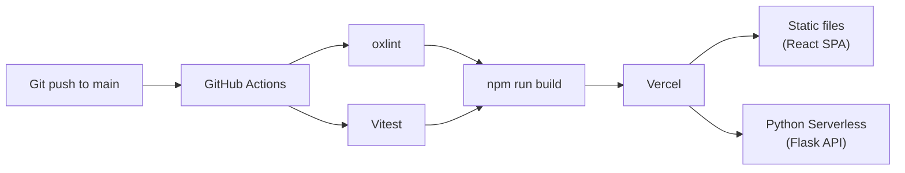

# Deployment Guide

> How LabHub is deployed and released.

## Deployment Architecture



## Automatic Deployment

Deploy is **automatic** on every push to `main`:

1. **Lint** — `oxlint` checks for code quality
2. **Test** — `vitest` runs all tests
3. **Build** — Production build if lint + test pass
4. **Deploy** — Vercel picks up the build and deploys

## Vercel Configuration

```json
// vercel.json
{
  "rewrites": [
    { "source": "/api/(.*)", "destination": "/api" }
  ]
}
```

- `/api/*` → Flask Serverless Function
- Everything else → React SPA (index.html)

## Environment Variables

### Vercel Dashboard
All environment variables are configured in the Vercel project settings:

| Variable | Environment |
|----------|------------|
| `SUPABASE_URL` | Production |
| `SUPABASE_SERVICE_KEY` | Production |
| `UPSTASH_REDIS_REST_URL` | Production |
| `VAPID_*` | Production |
| `CRON_SECRET` | Production |

### GitHub Actions
CI secrets are in the repository settings.

## Cron Jobs

Defined in `.github/workflows/push-cron.yml`:

| Schedule | Endpoint | Purpose |
|----------|----------|---------|
| Every 15 min | `/api/push/check` | Upcoming reservations |
| Every 15 min | `/api/push/check-overdue` | Overdue loans |
| Every 15 min | `/api/push/check-pcare` | PCare alerts |
| Daily | `/api/push/check-all` | All checks |

## Rollback

Vercel maintains deployment history. To rollback:
1. Go to Vercel Dashboard → Deployments
2. Find the last known good deployment
3. Click "Promote to Production"

## Monitoring

- **Vercel Analytics** — Performance metrics
- **Vercel Logs** — Serverless function logs
- **Supabase Dashboard** — Database metrics and RLS logs

## Related

- [Architecture: Backend](../architecture/backend.md)
- [Operations: Deployment](../operations/deployment.md)
