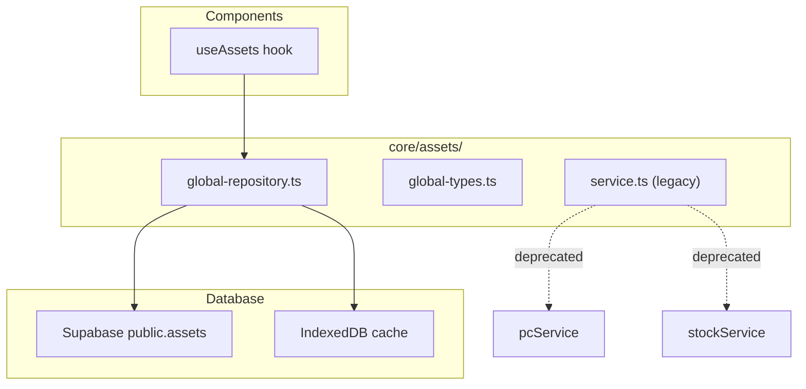

# Assets — Architecture

> How the Global Asset Registry works internally.

## Components



## Repository Pattern

`global-repository.ts` provides:
```typescript
getAll(workspaceId?: string): Asset[]
getById(id: string): Asset | undefined
create(data: CreateAssetInput): Asset
update(id: string, data: Partial<Asset>): Asset | undefined
remove(id: string): boolean
stats(workspaceId: string): AssetStats
```

## Legacy Coexistence

- `core/assets/service.ts` (legacy) imports `pcService` + `stockService` — will be removed
- `apps/pcare/services/assetService.ts` uses the `assets` collection (local-only)
- `global_assets` is the new collection with remote sync and RLS
- Different collections, different types, different Supabase schemas — no conflicts

## Types

```typescript
interface Asset {
  id: string
  workspace_id: string
  asset_tag: string | null
  serial_number: string | null
  equipment_type: string
  manufacturer: string
  model: string
  name: string
  location_id: string | null
  status: 'draft' | 'active' | 'maintenance' | 'retired'
  notes: string
  metadata: Record<string, any>
  created_by: string | null
  created_at: string
  updated_at: string
}
```

## Related

- [Overview](overview.md)
- [Concepts: Assets](../../concepts/assets.md)
