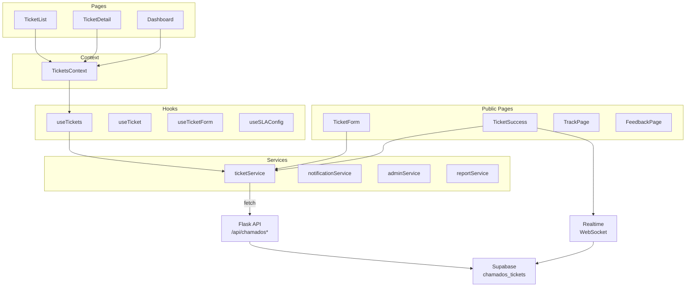

# Chamados — Architecture

> How the Chamados module works internally.

## Component Architecture



## State Management

### TicketsContext
Provides shared ticket state across the Chamados layout:
```typescript
{
  tickets: Ticket[]
  loading: boolean
  syncing: boolean
  reload: () => Promise<void>
  create: (data: TicketFormData) => Promise<Ticket>
  update: (id: string, data: Partial<Ticket>) => Ticket | undefined
  updateStatus: (id: string, status: TicketStatus) => Ticket | undefined
  remove: (id: string) => boolean
}
```

### Local State
- `ticketService` maintains a local collection in localStorage (`labhub_chamados`)
- Operations write to local first, then sync via API
- Realtime provides instant remote updates

## Data Flow

### Create Ticket
```
TicketForm → ticketService.create() → POST /api/chamados
    → Flask validates + generates ticketNumber
    → Supabase INSERT
    → Push notification to TI
    → Returns ticket to frontend
```

### Update Status
```
TicketDetail → updateStatus() → PATCH /api/chamados/:id
    → Supabase UPDATE
    → Realtime broadcasts change
    → Professor sees update instantly
```

### Real-time Subscription
```
useRealtimeSubscription('chamados_tickets', '*', callback)
    → WebSocket receives INSERT/UPDATE
    → Callback merges into local state
    → UI re-renders
```

## File Structure

```
src/apps/chamados/
├── index.tsx                    # Route definitions
├── contexts/TicketsContext.tsx  # Shared ticket state
├── hooks/useTickets.ts          # CRUD operations
├── layouts/ChamadosLayout.tsx   # Main layout with nav
├── pages/
│   ├── Dashboard.tsx           # Stats, SLA overview
│   ├── TicketList.tsx          # Filtered ticket list
│   └── TicketDetail.tsx        # Full ticket view
├── services/
│   ├── ticketService.ts        # API communication
│   ├── sla.ts                  # SLA calculations
│   ├── slaConfigService.ts     # SLA config CRUD
│   ├── problemTemplateService.ts
│   ├── roomService.ts
│   └── ticketAlerts.ts
├── types/
│   ├── ticket.ts               # Ticket types
│   ├── index.ts                # Re-exports
│   ├── events.ts               # Event types
│   ├── sla.ts                  # SLA types
│   └── problemTemplate.ts
└── components/                 # UI components
```

## Related

- [Overview](overview.md)
- [Workflows](workflows.md)
