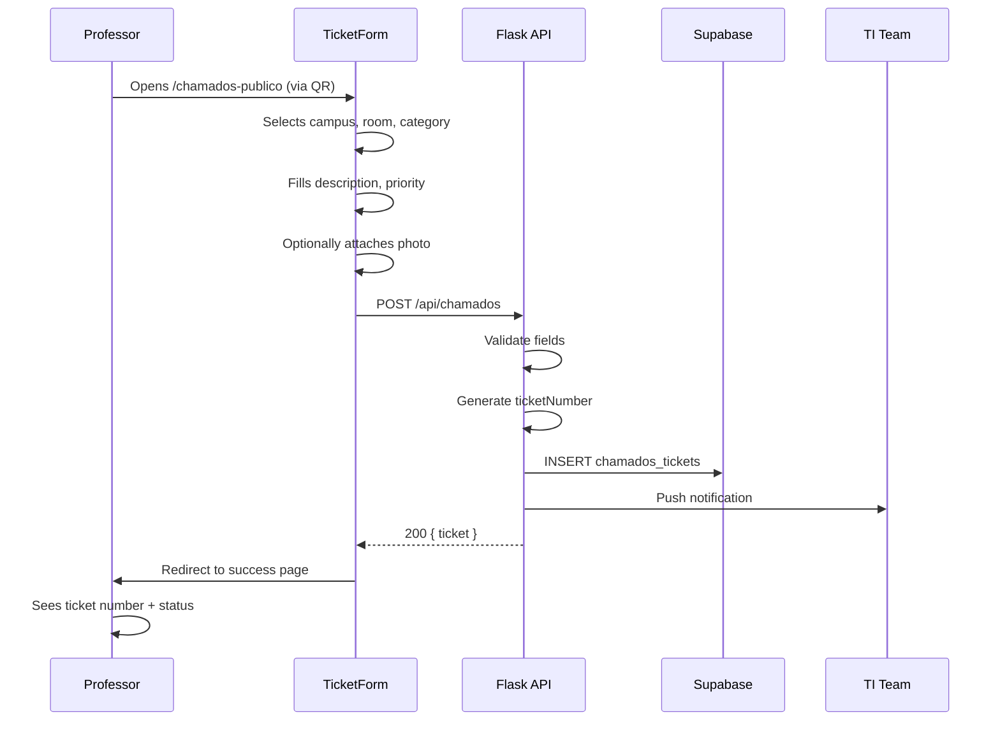
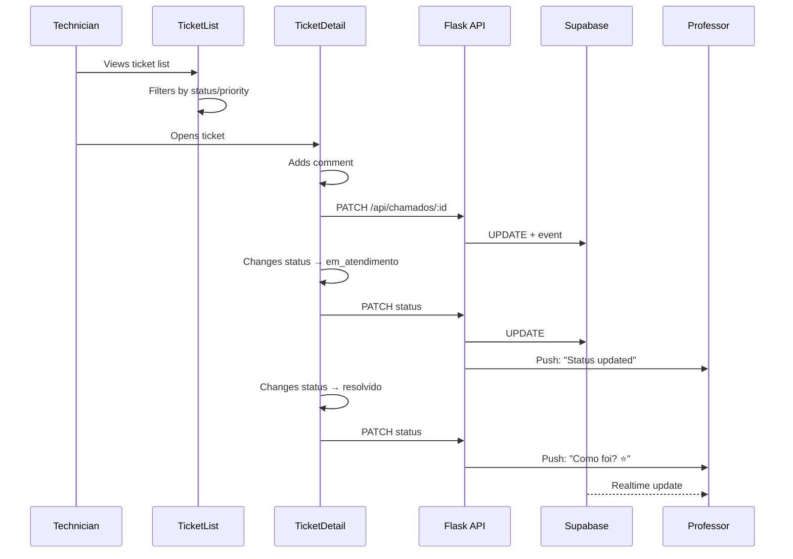
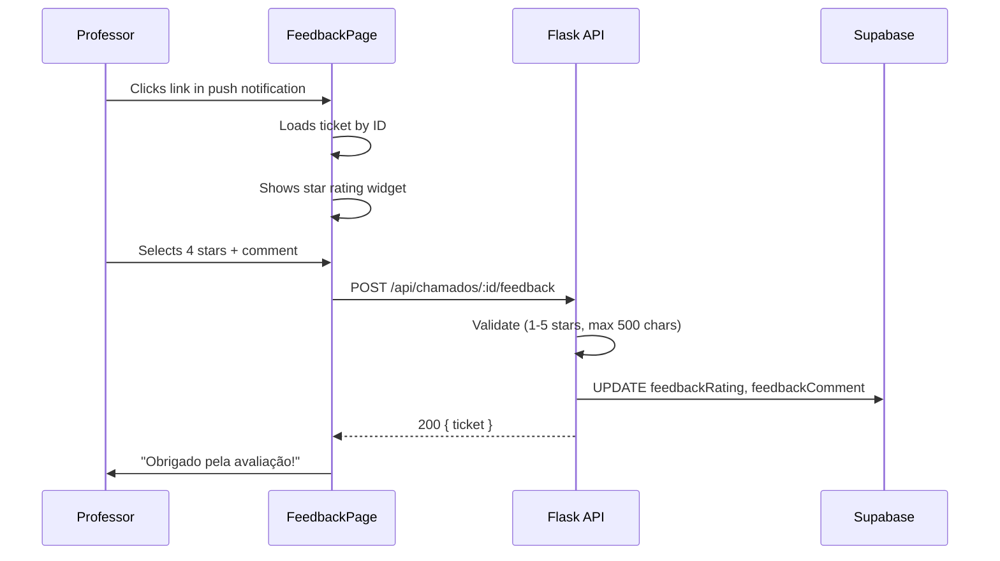
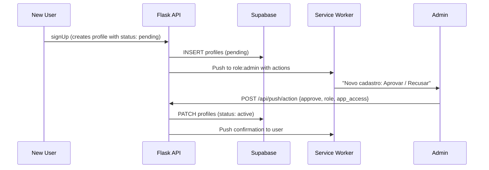

# Chamados — Workflows

> Step-by-step user flows for the Chamados module.

## Workflow 1: Create Ticket (Professor)

## Workflow 2: Resolve Ticket (Technician)

## Workflow 3: Rate Service (Professor)

## Workflow 4: Approve User (Admin)

## Workflow 5: Batch Operations (Technician)

1. Select multiple tickets via checkboxes
2. BatchActionBar appears with options:
   - Archive selected
   - Assign to technician
   - Change priority
   - Change status
3. Confirmation dialog
4. All selected tickets updated
5. List refreshes

## Related

- [Overview](overview.md)
- [Architecture](architecture.md)
- [Reference](reference.md)
