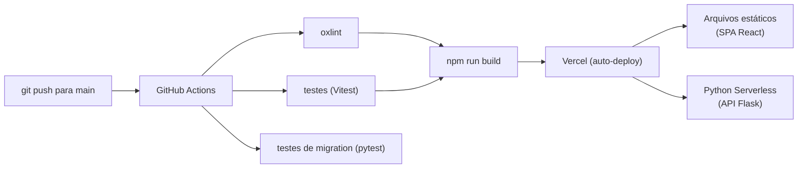

# Deploy

> Como o LabHub é publicado e como reverter uma publicação.

## Arquitetura de deploy

## Deploy automático

O deploy acontece **automaticamente** a cada push para `main`:

1. **Lint** — `oxlint` verifica a qualidade do código
2. **Testes** — `vitest` executa a suíte do frontend; `pytest` valida o runner de migrations e a migration 039
3. **Build** — `npm run build` gera o pacote de produção quando lint e testes passam
4. **Deploy** — a Vercel publica o build e as funções serverless

A esteira completa está em `.github/workflows/ci.yml`.

## Configuração da Vercel

`vercel.json` define:

- **Builds** — `api/app.py` com `@vercel/python` e o frontend com `@vercel/static-build` (`dist/`)
- **Rotas** — `/api/*` encaminha para `api/app.py`; as demais rotas caem no `index.html` da SPA
- **Cabeçalhos** — cache imutável para `/assets/*` e revalidação para o manifesto PWA

## Variáveis de ambiente

Todas as variáveis de produção ficam em **Vercel → Settings → Environment Variables**. Nunca versione valores reais; use o `.env.example` como documentação.

| Variável | Ambiente |
|----------|----------|
| `SUPABASE_URL` | Produção |
| `SUPABASE_SERVICE_KEY` | Produção |
| `RBAC_2_ENABLED` | Produção (feature flag do RBAC 2.0) |
| `UPSTASH_REDIS_REST_URL` / `UPSTASH_REDIS_REST_TOKEN` | Produção |
| `VAPID_PUBLIC_KEY` / `VAPID_PRIVATE_KEY` | Produção |
| `CRON_SECRET` | Produção e secrets do GitHub |
| `YOUTUBE_API_KEY` | Produção (TV) |
| `RESEND_API_KEY` / `EMAIL_FROM` | Produção (resumo semanal de chamados) |

A lista completa está em [Referência: configuração](../reference/configuration.md).

Os secrets de CI ficam nas configurações do repositório no GitHub.

## Agendamentos (cron)

| Origem | Agendamento | Endpoint | Propósito |
|--------|-------------|----------|-----------|
| GitHub Actions (`.github/workflows/push-cron.yml`) | A cada 5 minutos | `GET /api/push/check-all` | Executa todos os checks de push em uma chamada |
| Vercel (`vercel.json`) | Diariamente às 06:00 | `GET /api/push/tablets/cleanup` | Limpa reservas de tablet canceladas há mais de um mês |

Os endpoints de cron exigem `Authorization: Bearer ${CRON_SECRET}`.

## Checklist antes do deploy

1. Testes passando (`npm run test:run` e `python -m pytest api/tests -q`)
2. Lint limpo (`npm run lint`)
3. Tipos sem erro (`npx tsc -b --noEmit`)
4. Build funcionando (`npm run build`)
5. Nenhum dado sensível em commit
6. Migrations aplicadas no ambiente correspondente, quando houver

## Rollback

A Vercel mantém o histórico de deploys:

1. Abra a Vercel → Deployments
2. Localize o último deploy saudável
3. Clique em "Promote to Production"
4. Confirme que a aplicação voltou ao estado esperado

O rollback não afeta dados: o banco Supabase é independente do deploy do frontend.

### Rollback do RBAC 2.0

Definir `RBAC_2_ENABLED=0` desativa imediatamente o enforcement, sem alteração de código e sem novo deploy. Veja [Autorização](../platform/security/authorization.md).

## Monitoramento do deploy

- **Vercel** — status do deploy, logs das funções serverless
- **Supabase** — desempenho do banco e logs de RLS
- **GitHub Actions** — status da esteira

Detalhes em [Monitoramento](monitoring.md).

## Relacionados

- [Monitoramento](monitoring.md)
- [Recuperação](recovery.md)
- [Arquitetura de backend](../platform/architecture/backend.md)
