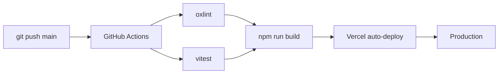

# Deployment Operations

> How to manage deployments and releases.

## Deployment Pipeline

## Current Deployment

- **Platform:** Vercel
- **Trigger:** Push to `main` branch
- **Frontend:** Static React SPA
- **Backend:** Python Serverless (Flask)
- **Cron:** GitHub Actions → Vercel cron endpoints

## Pre-deployment Checklist

1. All tests passing (`npm test`)
2. Lint clean (`npm run lint`)
3. Type check clean (`npx tsc -b --noEmit`)
4. Build succeeds (`npm run build`)
5. No sensitive data in commits

## Rollback Procedure

1. Vercel Dashboard → Deployments
2. Find last known good deployment
3. Click "Promote to Production"
4. Verify the rollback worked

## Environment Variables

All env vars are in Vercel Dashboard → Settings → Environment Variables.

**Never commit env vars.** Use `.env.example` for documentation.

## Monitoring

- **Vercel Dashboard** — Deployment status, function logs
- **Supabase Dashboard** — Database performance, RLS logs
- **GitHub Actions** — CI/CD pipeline status

## Related

- [Guides: Deployment](../guides/deployment.md)
- [Architecture: Backend](../architecture/backend.md)
