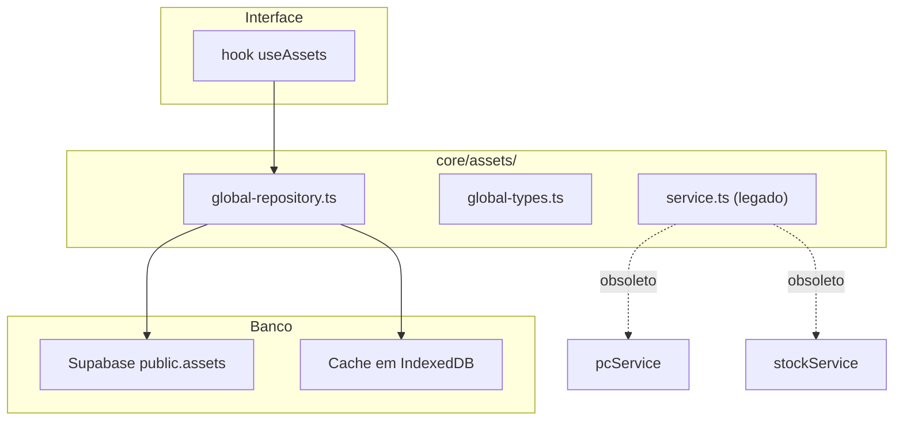

# Registro Global de Ativos

> Entidade global de ativos de TI, independente do PC Care e do Estoque. Criada na migration 024.

O Registro Global de Ativos é uma capacidade da plataforma, não uma aplicação independente: ele fornece a visão unificada de bens físicos consumida pelas aplicações. O conceito está descrito em [Conceitos: Ativos](../concepts/assets.md).

---

## Visão geral

A tabela `public.assets` representa ativos de TI de forma independente das coleções das aplicações. Cada ativo pertence a um workspace e é isolado por RLS.

```text
┌─────────────────────────────────────────────────────────┐
│  public.assets (Supabase)                               │
│  Tabela global, RLS por workspace                       │
├─────────────────────────────────────────────────────────┤
│  global_assets (IndexedDB)                              │
│  Coleção local, sincronizada com o Supabase             │
├─────────────────────────────────────────────────────────┤
│  core/assets/global-repository.ts                       │
│  CRUD + estatísticas, sem importar nada de apps/*       │
└─────────────────────────────────────────────────────────┘
```

## Componentes



## Modelo de dados

| Campo | Tipo | Obrigatório | Descrição |
|-------|------|-------------|-----------|
| `id` | UUID | Sim | Chave primária, gerada automaticamente |
| `workspace_id` | UUID (FK) | Sim | Workspace ao qual o ativo pertence |
| `asset_tag` | TEXT | Não | Patrimônio, único por workspace quando não nulo |
| `serial_number` | TEXT | Não | Número de série do fabricante |
| `equipment_type` | TEXT | Sim | Tipo: Desktop, Notebook, Monitor etc. |
| `manufacturer` | TEXT | Sim | Fabricante |
| `model` | TEXT | Sim | Modelo |
| `name` | TEXT | Sim | Nome legível |
| `location_id` | UUID | Não | Reservado para o futuro registro de localizações |
| `status` | TEXT | Sim | `draft`, `active`, `maintenance`, `retired` |
| `notes` | TEXT | Sim | Observações livres |
| `metadata` | JSONB | Não | Extensão por aplicação (ver política abaixo) |
| `created_by` | UUID | Não | Usuário que criou o registro |
| `created_at` | TIMESTAMPTZ | Sim | Data de criação |
| `updated_at` | TIMESTAMPTZ | Sim | Data da última atualização |

### Índices

- `idx_assets_workspace_id` — filtro por workspace
- `idx_assets_asset_tag` — busca por patrimônio
- `idx_assets_serial_number` — busca por número de série
- `idx_assets_status` — filtro por status
- `idx_assets_equipment_type` — filtro por tipo
- `idx_assets_workspace_asset_tag` — unicidade de `asset_tag` por workspace (parcial)

## Política de `metadata`

`metadata` é um campo JSONB extensível para dados específicos de uma aplicação.

**Regra:** campos usados por mais de uma aplicação devem ser promovidos a campos estruturais em uma evolução futura. `metadata` não é um depósito genérico.

- **Uso correto:** o PC Care armazena dados técnicos em `metadata.technical` (processador, memória), que são específicos daquela aplicação.
- **Uso incorreto:** guardar `status` ou `equipment_type` em `metadata` — ambos já existem como campos estruturais.
- **Revisão periódica:** quando um campo de `metadata` passa a ser usado por mais de uma aplicação, deve virar campo estrutural.

## Identificadores

- **`id` (UUID)** — chave primária permanente, usada internamente e na sincronização. Nunca muda.
- **`asset_tag`** — identificador externo do ativo (patrimônio). Único por workspace, pode ser nulo.
- **`serial_number`** — número de série do fabricante. Usado em busca, sem restrição de unicidade nesta fase.

Um eventual QR Code apontará para o UUID (`id`), não para o `asset_tag`.

## Repositório

`global-repository.ts` expõe:

```typescript
getAll(workspaceId?: string): Asset[]
getById(id: string): Asset | undefined
create(data: CreateAssetInput): Asset
update(id: string, data: Partial<Asset>): Asset | undefined
remove(id: string): boolean
getByAssetTag(tag: string): Asset | undefined
getBySerial(serial: string): Asset | undefined
stats(workspaceId: string): AssetStats
```

Exemplo de uso:

```typescript
import { globalAssetRepository } from '../core/assets/global-repository'

// Criar (workspace_id e created_by são atribuídos automaticamente)
const novo = globalAssetRepository.create({
  name: 'Desktop Lab A',
  equipment_type: 'Desktop',
  manufacturer: 'Dell',
  model: 'OptiPlex 7090',
  asset_tag: 'TI-001',
  serial_number: 'SN12345',
  location_id: null,
  status: 'active',
  notes: '',
  metadata: {},
})

globalAssetRepository.update(novo.id, { name: 'Desktop Lab A - Atualizado' })
globalAssetRepository.remove(novo.id)
```

Não há endpoints Flask para ativos: todo acesso passa pelo cliente Supabase com RLS.

## Segurança

### RLS

```sql
USING (
  public.is_super_admin()
  OR workspace_id IN (
    SELECT unnest(workspace_ids)
    FROM public.profiles
    WHERE id = auth.uid()
  )
)
```

- **Super admins** veem ativos de todos os workspaces
- **Usuários comuns** veem apenas ativos dos workspaces a que pertencem
- **Sincronização** usa o cliente autenticado (JWT do usuário), não `service_role`; o RLS protege pull e push
- **Defesa em profundidade** — `workspaceStore.filter()` no frontend é a segunda barreira

### `workspace_id`

- Atribuído automaticamente pelo repositório no `create()`, a partir do workspace ativo
- Validado pelo RLS no banco — o backend é a autoridade final
- Se o frontend informar um `workspace_id` indevido, o RLS rejeita a operação

## Coexistência com o legado

```text
┌─────────────────────────────────────────────────────────┐
│  Coleção "assets" (IndexedDB)                           │
│  → usada por pcare/services/assetService.ts             │
│  → tipo Asset (pcare/types/asset.ts)                    │
│  → somente local, sem sync remoto                       │
├─────────────────────────────────────────────────────────┤
│  Coleção "global_assets" (IndexedDB)                    │
│  → usada por core/assets/global-repository.ts           │
│  → tipo GlobalAsset (core/assets/global-types.ts)       │
│  → remota, com sync para public.assets                  │
└─────────────────────────────────────────────────────────┘
```

Nenhum dado legado é migrado automaticamente. As duas coleções coexistem: são coleções, tipos e schemas distintos.

| Aplicação | Afetada? | Observação |
|-----------|----------|------------|
| PC Care | Não | Continua usando sua coleção própria de ativos |
| Estoque | Não | `stockService` inalterado |
| Chamados | Não | Consome `core/assets/service` apenas como agregador |
| `core/assets` (agregador legado) | Não | Continua funcionando |

## Evoluções previstas

- **Registro de localizações** — criar `public.locations` e popular `location_id`
- **QR Code** — gerar código apontando para o UUID do ativo
- **Migração de dados** — migrar ativos do PC Care e do Estoque para o Registro Global
- **Promoção de `metadata`** — campos usados por várias aplicações viram colunas estruturais

## Relacionados

- [Conceitos: Ativos](../concepts/assets.md)
- [Camada de dados](data-layer.md)
- [Referência do banco](../../reference/database.md)
- [ADRs](../decisions/README.md)
