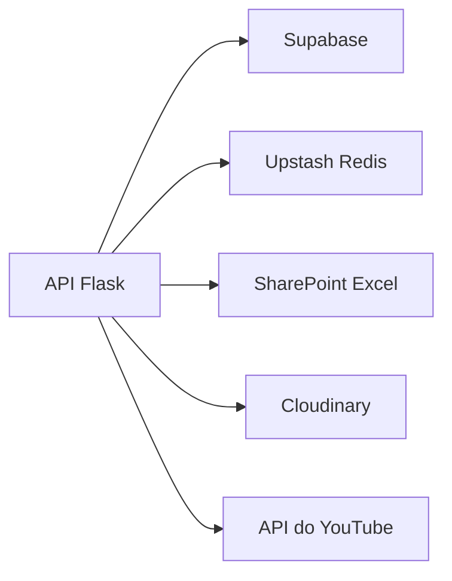

# Arquitetura de backend

> Como a API Flask funciona?

## Visão geral

O backend do LabHub é uma aplicação Flask (Python) publicada como Vercel Serverless Functions. Ele é responsável por:

- Gestão de chamados
- Notificações push (Web Push via VAPID)
- Dados do ReservaLab (integração com planilha Excel no SharePoint)
- Integração com o YouTube para a TV
- Fluxo de aprovação de usuários
- **Autorização RBAC 2.0** (por Action, com negação por padrão)

## Ponto de entrada

```text
api/app.py (entry point da Vercel)
    ↓ importa
src/apps/reservalab/api/app.py (aplicação Flask principal)
```

Todas as rotas `/api/*` são definidas em `src/apps/reservalab/api/app.py`.

## Grupos de rotas

### Chamados (`/api/chamados*`)

| Método | Rota | Propósito | Action de RBAC |
|--------|------|-----------|----------------|
| POST | `/api/chamados` | Abrir chamado (formulário público) | — |
| GET | `/api/chamados` | Listar chamados com filtros | — (legado) |
| GET | `/api/chamados/:id` | Detalhe do chamado | `ticket.view` |
| PATCH | `/api/chamados/:id` | Atualizar chamado | `ticket.status` / `ticket.assign` / `ticket.edit` |
| DELETE | `/api/chamados/:id` | Excluir chamado | `ticket.delete` |
| GET | `/api/chamados/:id/events` | Histórico do chamado | `ticket.view` |
| POST | `/api/chamados/:id/events` | Adicionar comentário | `ticket.comment` |
| POST | `/api/chamados/:id/feedback` | Registrar avaliação (público) | — |
| GET | `/api/chamados/reports` | Relatórios agregados | — (legado) |
| POST | `/api/chamados/reports/weekly-email` | Enviar resumo semanal | `ticket.weeklyEmail` (global) |
| POST | `/api/chamados/workspaces` | Listar campi disponíveis | — |
| POST | `/api/chamados/photos/purge` | Limpar fotos órfãs | — |

### Push (`/api/push/*`)

| Método | Rota | Propósito | Action de RBAC |
|--------|------|-----------|----------------|
| POST | `/api/push/subscribe` | Registrar inscrição de push | — |
| GET | `/api/push/test` | Enviar notificação de teste | — (legado) |
| POST | `/api/push/send` | Enviar push segmentado | `reservelab.push.manage` (global) |
| POST | `/api/push/action` | Tratar ações da notificação | — (legado) |
| GET | `/api/push/check` | Cron: reservas próximas | — (cron) |
| GET | `/api/push/check-overdue` | Cron: empréstimos vencendo | — (cron) |
| GET | `/api/push/check-pcare` | Cron: alertas do PC Care | — (cron) |
| GET | `/api/push/check-all` | Cron: todos os checks agregados | — (cron) |

### Administração (`/api/admin/*`)

| Método | Rota | Propósito | Action de RBAC |
|--------|------|-----------|----------------|
| POST | `/api/admin/wipe` | Apagar dados operacionais | `admin.system.wipe` (global) |
| POST | `/api/admin/app-data/describe` | Descrever dados de uma aplicação | `admin.app.purge` (workspace) |
| POST | `/api/admin/app-data/purge` | Apagar dados de uma aplicação | `admin.app.purge` (workspace) |
| GET | `/api/admin/audit-logs` | Listar logs de auditoria do RBAC | `admin.audit.view` (global) |
| POST | `/api/admin/backups` | Listar backups | — (`require_admin`) |
| POST | `/api/admin/backups/prune` | Excluir backups expirados | `admin.backup.delete` (global) |
| POST | `/api/admin/backups/:id/restore` | Restaurar backup | `admin.backup.restore` (global) |
| DELETE | `/api/admin/backups/:id` | Excluir backup | `admin.backup.delete` (global) |
| POST | `/api/admin/workspaces/:id/delete` | Excluir workspace | `admin.workspace.delete` (global) |

### TV (`/api/tv/*`)

| Método | Rota | Propósito | Action de RBAC |
|--------|------|-----------|----------------|
| POST | `/api/tv/youtube/fetch` | Buscar metadados do YouTube | — |
| POST | `/api/tv/youtube/search` | Pesquisar no YouTube | — |
| POST | `/api/tv/calendar/extract` | Extrair eventos de calendário | — |
| POST | `/api/tv/source/fetch` | Buscar fonte de eventos da TV | — |
| GET | `/api/tv/youtube/live` | Status de transmissão ao vivo | — |
| POST | `/api/tv/cloudinary/delete` | Excluir imagem da TV | `tv.content.manage` (workspace) |
| GET | `/api/tv/health` | Status do servidor | — |
| POST | `/api/tv/activation/create` | Criar código de ativação | — |
| POST | `/api/tv/activation/redeem` | Resgatar código de ativação | — |
| POST | `/api/tv/devices/provision` | Provisionar dispositivo | — |
| GET | `/api/tv/chamados/display` | Exibir chamados na TV | — |

### ReservaLab

| Método | Rota | Propósito |
|--------|------|-----------|
| GET | `/api/reservas` | Reservas de laboratório a partir da planilha no SharePoint |
| GET | `/api/health` | Status do servidor |

### Rotas públicas (sem autenticação)

| Método | Rota | Propósito |
|--------|------|-----------|
| GET | `/api/public/chamados/:tracking_token` | Consulta pública de chamado |
| GET | `/api/public/chamados/:tracking_token/events` | Histórico público do chamado |
| POST | `/api/public/chamados/:tracking_token/feedback` | Avaliação pública |
| POST | `/api/public/chamados/:tracking_token/subscribe` | Inscrição pública em push |

## Enforcement do RBAC 2.0

Dois mecanismos protegem as rotas.

### Decorator (`require_action_rbac`)

Aplicado no nível da rota, quando o workspace é conhecido de antemão:

```python
@app.route('/api/admin/wipe', methods=['POST'])
@require_auth
@require_admin
@require_action_rbac('admin.system.wipe', scope='global')
def admin_wipe():
    ...
```

### Verificação no handler (`_require_action_in_handler`)

Usado nas rotas em que o workspace só é resolvido **depois** de buscar o recurso:

```python
g.workspace_id = ticket_ws  # workspace derivado do recurso
err = _require_action_in_handler('ticket.view', scope='workspace',
                                  resource_type='ticket', resource_id=ticket_id)
if err:
    return err
```

### Fail-closed

Os dois mecanismos são *fail-closed*: qualquer erro na engine de autorização resulta em negação, nunca em liberação.

## Segurança

- **RBAC 2.0** — autorização por Action, quando `RBAC_2_ENABLED=1`
- **Bypass de RLS** — uso de `SUPABASE_SERVICE_KEY` para operações que exigem permissão elevada
- **CORS** — habilitado para o domínio do frontend
- **Proteção de cron** — rotas `/api/push/check*` exigem `CRON_SECRET` no cabeçalho `Authorization`
- **Validação de entrada** — todos os endpoints validam os campos obrigatórios
- **Módulo desabilitado** — `require_module()` verifica se a aplicação está habilitada no workspace
- **Isolamento de workspace** — `require_workspace()` valida que o usuário pertence ao workspace

## Integrações externas



| Serviço | Propósito |
|---------|-----------|
| Supabase | Banco principal (acesso com `service_role`) |
| Upstash Redis | Inscrições de push, cache de deduplicação e cache de reservas |
| SharePoint Excel | Dados de reservas do ReservaLab (somente leitura) |
| Cloudinary | Upload de fotos (Chamados e PC Care) |
| API do YouTube | Metadados de vídeo para as playlists da TV |

## Padrões de código do backend

### Módulos

Módulos novos são funções puras, sem Flask e sem instanciar `app`:

```python
# api/meu_modulo.py — SEM Flask
import logging
logger = logging.getLogger(__name__)

def get_meus_dados(parametro=None):
    try:
        return {'dados': [...], 'total': N}
    except Exception as e:
        logger.error(f"Erro: {e}")
        return {'error': str(e), 'dados': [], 'total': 0}
```

Nunca levante exceção em módulos de dados: retorne um dicionário com a chave `error`.

### Serialização de datas

```python
class DateEncoder(json.JSONEncoder):
    def default(self, obj):
        if isinstance(obj, (date, datetime)):
            return obj.strftime('%d/%m/%Y')
        return super().default(obj)
```

## Variáveis de ambiente

| Variável | Obrigatória | Propósito |
|----------|-------------|-----------|
| `SUPABASE_URL` | Sim | URL do projeto Supabase |
| `SUPABASE_SERVICE_KEY` | Sim | Chave de serviço (ignora RLS) |
| `RBAC_2_ENABLED` | Não | Liga o enforcement do RBAC 2.0 (`1` = ligado) |
| `UPSTASH_REDIS_REST_URL` | Não | Redis para push e cache |
| `UPSTASH_REDIS_REST_TOKEN` | Não | Token do Redis |
| `VAPID_PUBLIC_KEY` | Não | Chave pública de Web Push |
| `VAPID_PRIVATE_KEY` | Não | Chave privada de Web Push |
| `CRON_SECRET` | Sim (crons) | Protege os endpoints de cron |
| `YOUTUBE_API_KEY` | Sim (TV) | YouTube Data API v3 |
| `SHAREPOINT_URL` | Não (legado) | Planilha de reservas de fallback |
| `RESEND_API_KEY` | Não | Envio de e-mail (resumo semanal de chamados) |
| `EMAIL_FROM` | Não | Remetente dos e-mails (padrão `LabHub <labhub@resend.dev>`) |

Detalhamento completo em [Referência: configuração](../../reference/configuration.md).

## Deploy

- Publicado automaticamente em push para `main`, via Vercel
- Python Serverless Functions, com cold start
- Cron jobs configurados em `.github/workflows/push-cron.yml`

## Relacionados

- [Arquitetura do sistema](system.md)
- [Autorização](../security/authorization.md)
- [RBAC 2.0](../rbac/README.md)
- [Referência da API](../../reference/api.md)
- [Operações: Deploy](../../operations/deployment.md)
