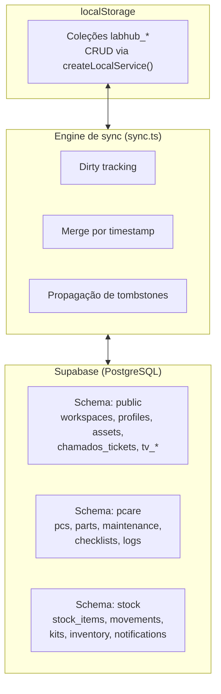

# Camada de dados

> Como o LabHub gerencia dados entre o armazenamento local e o remoto?

## Arquitetura em três camadas



## localStorage (fonte de verdade local)

### Estrutura

- Prefixo: `labhub_`
- Cada coleção é um array JSON armazenado como string
- Acesso por `getCol<T>(collection)` e `setCol(collection, items)`

### Camada de serviço

```typescript
createLocalService<T>(collection) → {
  getAll(), getById(), create(), update(), remove(), query()
}
```

### Camada de serviço com sincronização

```typescript
createSyncService<T>(collection) → {
  // Mesma API de createLocalService
  // Adicionalmente: marca a coleção como dirty nas escritas
  // Adicionalmente: rastreia exclusões para propagação remota
}
```

## Supabase (banco remoto)

### Schemas

| Schema | Tabelas | Forma de acesso |
|--------|---------|-----------------|
| `public` | `workspaces`, `profiles`, `assets`, `chamados_tickets`, `tv_*`, `tablet_reservations` | RLS + `service_role` |
| `pcare` | `pcs`, `parts`, `part_usage`, `maintenance`, `checklists`, `logs` | Engine de sync |
| `stock` | `stock_items`, `movements`, `kits`, `inventory`, `notifications` | Engine de sync |

### Row Level Security (RLS)

Todas as tabelas de `pcare` e `stock` usam RLS com políticas por operação (SELECT, INSERT, UPDATE e DELETE), apoiadas na função auxiliar `user_belongs_to_workspace()`:

```sql
-- Função com sobrecargas text/uuid (migration 027)
CREATE OR REPLACE FUNCTION public.user_belongs_to_workspace(ws_id text)
RETURNS boolean LANGUAGE sql STABLE SECURITY DEFINER AS $$
  SELECT ws_id IS NULL OR ws_id = ''
      OR ws_id IN (
        SELECT unnest(workspace_ids)::text
        FROM public.profiles WHERE id = auth.uid()
      )
$$;
-- Também existe a sobrecarga uuid para colunas workspace_id com FK
```

Padrão de política:

```sql
CREATE POLICY "{table}_select" ON schema.table FOR SELECT
  USING (is_super_admin() OR user_belongs_to_workspace(workspace_id));
```

Comportamentos relevantes:

- **Super admin** (`is_super_admin()`) ignora todas as políticas
- **`workspace_id` nulo** (registros legados) é visível para todos
- **`service_role`** ignora o RLS por completo (usado por triggers e pela API Flask)

### Exceções

- `chamados_tickets` tem `REVOKE ALL FROM anon, authenticated` — somente a API Flask (`service_role`) acessa a tabela
- A função `pg_sql()` tem `REVOKE` para `anon`, `authenticated` e `PUBLIC` (migration 025)

## Padrões de acesso a dados

### Padrão 1 — Supabase direto (ativos globais)

```text
Componente → useAssets() → global-repository.ts → Supabase (RLS)
```

### Padrão 2 — Engine de sync (PC Care, Estoque)

```text
Componente → pcService → createSyncService → localStorage + marcação dirty
                                                   ↓
                                          syncAll() → Supabase
```

### Padrão 3 — API Flask (Chamados)

```text
Componente → ticketService → fetch('/api/chamados') → Flask → Supabase
```

### Padrão 4 — Fonte externa (ReservaLab)

```text
Componente → fetch('/api/reservas') → Flask → planilha Excel no SharePoint
```

## Coleções somente locais

Estas coleções não têm tabela remota e existem apenas no `localStorage`:

- `assets` (ativos legados do PC Care)
- `chamados` (cache local, não usado para escrita)
- `rooms`, `problem_templates`, `sla_configs`
- `audit_logs`, `user_profiles`, `roles`

## Relacionados

- [Sincronização](../concepts/synchronization.md)
- [Offline-first](../concepts/offline-first.md)
- [Referência do banco](../../reference/database.md)
- [Registro global de ativos](asset-registry.md)
