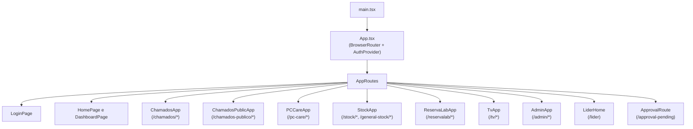
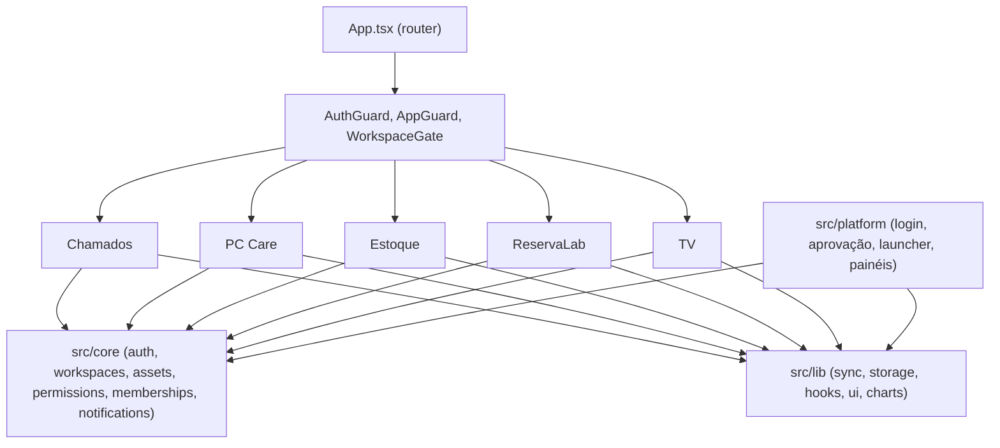

# Arquitetura de frontend

> Como o frontend React está estruturado?

## Stack

- **React 19** com TypeScript
- **Vite** para build
- **Tailwind CSS v4** para estilos
- **Radix UI** para primitivas acessíveis
- **Framer Motion** para animações
- **React Router** para roteamento
- **Vitest + Testing Library** para testes

## Estrutura da aplicação

Todas as aplicações são carregadas sob demanda com `React.lazy()`, mantendo o bundle inicial pequeno.

## Fronteiras entre camadas

As aplicações não importam código umas das outras: toda dependência compartilhada passa por `core/` ou `lib/`.

## Sistema de layout

Cada aplicação tem seu próprio layout com navegação:

- **Desktop**: navegação lateral
- **Celular**: barra de navegação inferior
- **Modo kiosk**: versão simplificada para tablets

Os layouts envolvem suas páginas e oferecem:

- Indicador de workspace ativo
- Selo de status de sincronização
- Sino de notificações
- Alternador de tema

## Provedores de contexto

| Contexto | Escopo | Propósito |
|----------|--------|-----------|
| `ThemeContext` | Por aplicação | Tema claro/escuro com persistência em `localStorage` |
| `ToastContext` | Global | Notificações dentro da aplicação |
| `TicketsContext` | Chamados | Estado e operações de chamados |
| `AuthContext` | Global | Estado de autenticação do usuário |
| `WorkspaceContext` | Global | Workspace ativo e lista de workspaces |

## Padrões de componente

### Componentes de UI (`src/lib/components/ui/`)

Primitivas baseadas em Radix: Button, Dialog, Popover, Select, Tabs etc.

### Componentes de gráfico (`src/lib/charts/`)

Envoltórios do Recharts: `BarChart`, `DonutChart`, `ChartCard`.

### Componentes de aplicação

Cada aplicação mantém seus componentes em `src/apps/<aplicacao>/components/`.

## Hooks

### Hooks globais (`src/lib/`)

| Hook | Propósito |
|------|-----------|
| `useOnlineSync` | Gerencia o ciclo de sincronização |
| `useRealtimeSubscription` | Assinaturas do Supabase Realtime |
| `useRealtimePresence` | Rastreio de presença de usuários |
| `useRealtimeBroadcast` | Comunicação entre abas |
| `usePushNotifications` | Inscrição em Web Push |
| `useLabContext` | Contexto do laboratório ativo |
| `useKioskMode` | Modo kiosk para tablets |
| `useMediaQuery` | Breakpoints responsivos |
| `useNavigateWithTransition` | View Transitions API |

### Hooks de aplicação

Cada aplicação tem hooks de domínio em `src/apps/<aplicacao>/hooks/`.

## Tratamento de erros

- O componente `ErrorBoundary` envolve cada aplicação
- Erros de API aparecem na interface, nunca via `alert()`
- Falhas de sincronização são registradas e repetidas automaticamente

## Testes

- Testes de unidade: `src/apps/<aplicacao>/pages/__tests__/`
- Setup: `src/test/setup.ts`
- Mocks: `src/test/mocks.ts`
- Helpers: `src/test/helpers.tsx`

## Relacionados

- [Arquitetura do sistema](system.md)
- [Camada de dados](data-layer.md)
- [Guia de desenvolvimento](../../guides/development.md)
