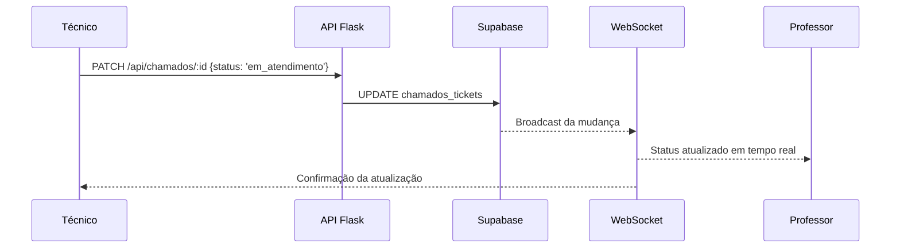

# Realtime

> Como o LabHub entrega atualizações instantâneas?

## O que é

O LabHub usa o Supabase Realtime (conexões WebSocket) para propagar mudanças de dados aos clientes conectados sem polling. O uso principal é no Chamados, para atualização instantânea de status.

## Como funciona

### Padrão de assinatura

```typescript
useRealtimeSubscription<TableType>(
  'table_name',           // tabela do Supabase
  '*',                    // tipo de evento: INSERT, UPDATE, DELETE ou *
  (payload) => { ... },   // callback com os dados novos/antigos
  {
    channelName: 'unique:channel:name',
    enabled: boolean,     // condição para assinar
  }
)
```

### Fluxo de realtime no Chamados



### Canal de broadcast

Para comunicação entre abas (por exemplo, o mesmo usuário em várias abas):

```typescript
useRealtimeBroadcast(channelName, {
  onBroadcast: (event) => { ... }
})

// Envio
broadcast({ event: 'ticket_updated', payload: data })
```

### Presença

Permite saber quais usuários estão vendo um chamado:

```typescript
useRealtimePresence(channelName, {
  user: { id, name, avatar }
})
```

## Fallback por polling

Quando o realtime não está disponível (offline ou navegador sem suporte):

- Polling a cada 15 segundos para os dados críticos
- Polling a cada 60 segundos para as estatísticas do dashboard
- Atualização manual por ação do usuário

## Convenção de nomes de canal

```text
chamados:public:{ticketId}        — atualizações de um chamado específico
chamados:workspace:{wsId}         — atualizações de todos os chamados do workspace
presence:{context}                — rastreio de presença
```

## Considerações de desempenho

- Cada assinatura cria uma conexão WebSocket
- Os canais são escopados a tabelas e filtros específicos
- As assinaturas são removidas automaticamente quando o componente é desmontado
- A flag `enabled` evita conexões desnecessárias

## Relacionados

- [Sincronização](../concepts/synchronization.md)
- [Arquitetura do sistema](system.md)
- [Referência de eventos](../../reference/events.md)
