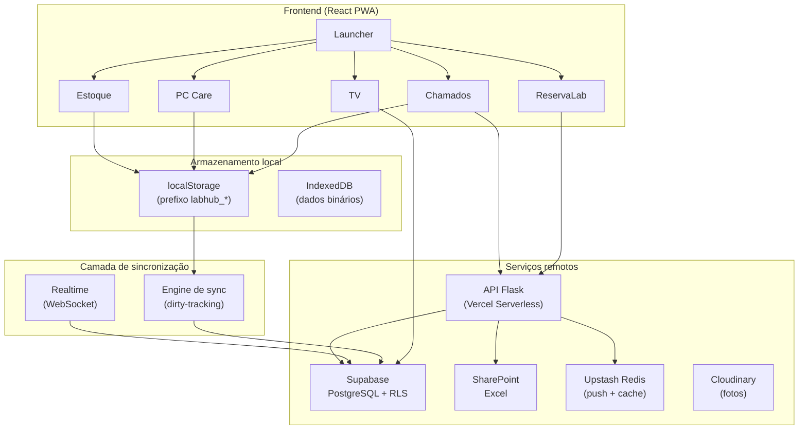

# Arquitetura do sistema

> Como o LabHub funciona como um todo?

## Visão de alto nível



## Padrões de fluxo de dados

### Padrão 1 — Local-first com sincronização (PC Care, Estoque)

```text
Componente → Serviço → localStorage → Engine de sync → Supabase
```

### Padrão 2 — Mediado pela API (Chamados)

```text
Componente → ticketService → API Flask → Supabase
                                  ↓
                        Notificação push → Upstash → Navegador
```

### Padrão 3 — Acesso remoto direto (TV, tablets do ReservaLab)

```text
Componente → cliente Supabase → Supabase (filtrado por RLS)
```

### Padrão 4 — Fonte externa (laboratórios do ReservaLab)

```text
Componente → API Flask → planilha Excel no SharePoint → cache (Redis/arquivo)
```

## Ciclo de vida de uma requisição

### Abertura de um chamado (Chamados)

1. O usuário preenche o formulário em `/chamados-publico`
2. `ticketService.create()` envia `POST /api/chamados`
3. O Flask valida os campos e gera o `ticketNumber` sequencial
4. O registro é inserido em `chamados_tickets` (Supabase)
5. Uma notificação push é disparada para a equipe de TI
6. O chamado é devolvido ao frontend
7. O realtime envia as mudanças de status ao professor

### Atualização do Estoque (offline-first)

1. O usuário edita um item na interface do Estoque
2. `stockService.update()` grava no `localStorage`
3. A coleção é marcada como dirty em `labhub_dirty_collections`
4. A engine de sync envia a alteração ao Supabase no ciclo seguinte
5. Outros dispositivos recebem a mudança na sincronização seguinte

## Decisões de projeto relevantes

- **localStorage no lugar de IndexedDB para os dados principais** — API mais simples, acesso síncrono e volume suficiente
- **Flask para a API do Chamados** — permite contornar o RLS e habilitar notificações push
- **RLS no Registro Global de Ativos** — acesso direto ao Supabase com isolamento por workspace
- **Carregamento sob demanda por aplicação** — cada aplicação é um chunk separado, carregado quando necessário

## Relacionados

- [Frontend](frontend.md)
- [Backend](backend.md)
- [Camada de dados](data-layer.md)
- [Realtime](realtime.md)
- [Aplicações](../concepts/applications.md)
