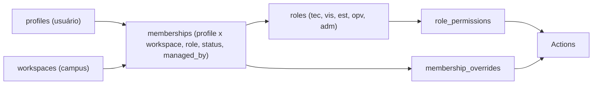

# Administração de workspaces

> Multi-tenancy e gestão de unidades na plataforma.

**Rota:** `/admin/workspaces` (somente admin)

## Propósito

A área de administração de workspaces gerencia campi e unidades organizacionais: criação, configuração e ciclo de vida, incluindo habilitação de aplicações, planilhas e quantidade de laboratórios.

## Recursos

- **CRUD de workspace** — criar, editar e excluir unidades
- **Controle de aplicações** — habilitar e desabilitar aplicações por unidade
- **Configuração de planilha** — link da planilha do ReservaLab por unidade
- **Quantidade de laboratórios** — `lab_count`
- **Backup de dados** — exportar e importar dados de um workspace
- **Duplicação** — clonar a estrutura de um workspace
- **Personalização de cor** — cor da unidade no launcher

## Workspace, memberships, roles e permissões



O vínculo entre usuário e workspace é a `membership`. A role define a base de permissões, os overrides ajustam caso a caso e cada permissão referencia uma Action do catálogo. Super admins (`profiles.is_super_admin`) ficam fora desse caminho e veem todos os workspaces.

A disponibilidade de uma aplicação combina duas informações: o campus precisa tê-la habilitada em `workspaces.disabled_apps` e o usuário precisa ter acesso concedido pela membership. A desativação no campus sempre prevalece.

## Ciclo de vida

```text
Criado → Configurado (aplicações, planilha) → Ativo → ...
                                                     ↓
                                        Excluído (com backup de 2 dias)
```

## Fonte de dados

- **Supabase** — tabela `workspaces`, com RLS
- **Cache local** — `labhub_workspaces` no `localStorage`
- **Engine de sync** — sincronização bidirecional

## Configuração de aplicações

Cada aplicação declara suas capacidades no registro (`src/appRegistry.ts`):

| Campo | Significado |
|-------|-------------|
| `configurable` | Pode ser configurada por admins dentro de um workspace |
| `clearable` | Declara a intenção de permitir expurgo de dados por workspace |
| `settings` | Contrato de configuração consumido por `core/appSettings` |
| `SettingsPanel` | Painel de configuração próprio da aplicação |

Configurações ficam em `workspace_app_settings`, lidas e gravadas diretamente pelo frontend via RLS. Cada aplicação traz sua própria interface de configuração; a plataforma não gera formulários automaticamente.

## Relacionados

- [Conceitos: Workspaces](../concepts/workspaces.md)
- [Autorização](../security/authorization.md)
- [Referência do banco](../../reference/database.md)
