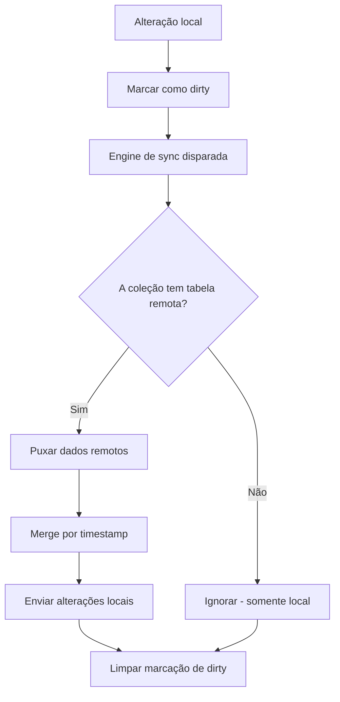

# Sincronização

> Como os dados fluem entre o localStorage e o Supabase?

## O que é

Sincronização é o processo de mesclar os dados do `localStorage` com os dados remotos do Supabase. Ela usa dirty-tracking, merge por timestamp e propagação de tombstones.

## Por que

Vários usuários e dispositivos precisam ver os mesmos dados. Quando um técnico atualiza um chamado no celular, os demais membros da equipe devem ver a mudança. A engine de sync garante consistência eventual entre os clientes.

## Engine de sync (`src/lib/sync.ts`)

### Coleções

As coleções se dividem em duas categorias.

**Com tabela remota:**

| Coleção | Schema |
|---------|--------|
| `pcs`, `parts`, `part_usage`, `maintenance`, `checklist_templates`, `pc_checklists`, `action_logs` | `pcare` |
| `stock_items`, `stock_movements`, `stock_kits`, `stock_maintenance`, `inventory_cycles`, `inventory_counts`, `notifications` | `stock` |
| `workspaces`, `global_assets` | `public` |

**Somente locais** (sem tabela remota):

`assets`, `chamados`, `rooms`, `problem_templates`, `sla_configs`, `audit_logs`, `user_profiles`, `roles`

### Fluxo



### Estratégia de merge

- Compara os timestamps de `updatedAt`
- A versão mais recente vence (não há resolução de conflito além do timestamp)
- Na primeira sincronização acontece apenas o pull; dados de seed locais nunca são enviados

### Propagação de tombstones

Quando um item é excluído localmente:

1. Seu identificador é adicionado a `labhub_deleted_ids` no `localStorage`
2. Na sincronização seguinte, o identificador é excluído do Supabase
3. Após a exclusão bem-sucedida, o tombstone é removido

### Camada de serviço

`createSyncService<T>()` envolve `createLocalService<T>()` com capacidades de sincronização:

```typescript
const pcService = createSyncService<PC>('pcs')

pcService.getAll()            // lê do localStorage
pcService.create(data)        // grava no localStorage e marca como dirty
pcService.update(id, data)    // grava no localStorage e marca como dirty
pcService.remove(id)          // remove localmente e marca para exclusão remota
```

## Realtime versus polling

| Mecanismo | Latência | Uso |
|-----------|----------|-----|
| Supabase Realtime | ~100 ms | Atualizações de chamados |
| Polling (15 s) | 15 s | Fallback para todas as coleções |
| Sincronização manual | Sob demanda | Atualização acionada pelo usuário |

## Relacionados

- [Offline-first](offline-first.md)
- [Camada de dados](../architecture/data-layer.md)
- [Realtime](../architecture/realtime.md)
