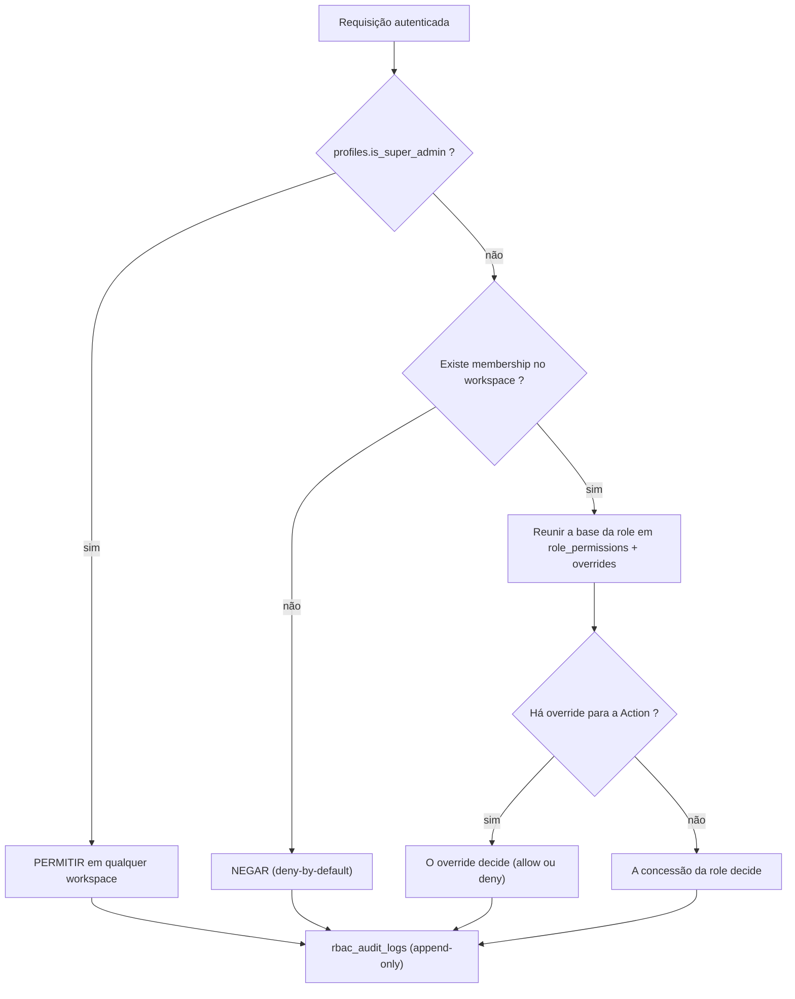

# RBAC 2.0

> Índice da documentação do modelo de autorização por Action do LabHub.

O RBAC 2.0 é a camada autoritativa de autorização do backend. Ele avalia uma **Action** contra a **membership** do usuário no workspace, com negação por padrão.

As quatro categorias de documento são distintas e não devem ser misturadas:

- **Especificação** — como o RBAC deve funcionar (normativo)
- **Arquitetura** — como o RBAC está integrado à plataforma
- **Design e rollout** — como cada etapa foi planejada e materializada
- **Auditoria** — o que foi analisado ou validado em determinado momento

## Como uma decisão é tomada

A ordem é sempre a mesma: bypass de super admin, membership no workspace, base da role com overrides por cima e, na ausência de qualquer concessão, negação.

---

## Especificação (normativa)

Documentos canônicos, referenciados diretamente por código, migrations e testes. **Não devem ser movidos nem duplicados.**

| Documento | Conteúdo |
|-----------|----------|
| [`docs/architecture/rbac2.0-specification.md`](../../architecture/rbac2.0-specification.md) | Especificação técnica: modelo de dados, roles, Actions, decisão |
| [`docs/architecture/rbac2.0-actions-catalog.md`](../../architecture/rbac2.0-actions-catalog.md) | Catálogo completo de Actions — fonte de verdade |

> **Exceção editorial registrada:** a especificação é um documento canônico congelado e contém, em alguns trechos, terminologia histórica de processo. Isso é uma dívida editorial conhecida: **não editar sem revisão formal do contrato RBAC 2.0**, porque o documento tem dependências diretas em código, migrations e testes.

## Arquitetura

| Documento | Conteúdo |
|-----------|----------|
| [Autorização](../security/authorization.md) | Camadas de acesso, enforcement e rollback |
| [Backend](../architecture/backend.md) | Decorator, verificação no handler e fail-closed |
| [Referência do banco](../../reference/database.md) | Tabelas de RBAC, políticas de RLS e migrations |

## Design e rollout

Documentos de cada etapa da materialização do RBAC 2.0.

| Documento | Etapa |
|-----------|-------|
| [Etapa 4 — Decisões e resolução de pendências](rbac2.0-etapa4-decisions.md) | Mapeamento de roles e resolução de `NEEDS_DECISION` |
| [Etapa 5 — Enforcement de rotas](rbac2.0-etapa5-enforcement.md) | Aplicação do RBAC no backend e rollout controlado |
| [Etapa 6 — Enforcement definitivo](rbac2.0-etapa6-enforcement.md) | Chamados e push |
| [Etapa 7 — Fechamento e ativação controlada](rbac2.0-etapa7-activation.md) | Decisões finais de rollout |
| [Fase 9.1 — Desenho técnico de membership e integridade de workspace](rbac2.0-fase-9.1-membership-workspace-design.md) | Eliminação de UUIDs fantasma e unificação do helper de RLS |

## Auditorias

| Documento | Conteúdo |
|-----------|----------|
| [Pré-RBAC 2.0: gap analysis](../../audits/architecture/rbac2.0-gap-analysis-2026-08.md) | Comparação do estado real com o modelo-alvo |
| [Autorização por sub-app e Actions](../../audits/architecture/rbac2.0-subapps-actions-audit-2026-08.md) | Como cada aplicação funcionava antes do catálogo |
| [Pós-produção RBAC 2.0](../../audits/architecture/rbac2.0-prod-audit-2026-09.md) | Verificação após a ativação em produção |
| [Fase 9.0 — Membership × Workspace](../../audits/architecture/rbac2.0-fase-9.0-membership-workspace-audit.md) | Drift entre o modelo legado e as memberships |
| [Fase 9.3-A — Inventário de `workspace_ids`](../../audits/architecture/rbac2.0-fase-9.3-a-workspace-ids-inventory.md) | Inventário do legado antes da remoção |
| [Hardening de RLS 044](../../audits/architecture/rbac2.0-rls-hardening-044-discovery.md) | Discovery, design e validações da migration 044 |

## Relacionados

- [Decisões arquiteturais](../decisions/README.md)
- [Glossário](../../glossary.md) — definições de Action, membership, role e override
