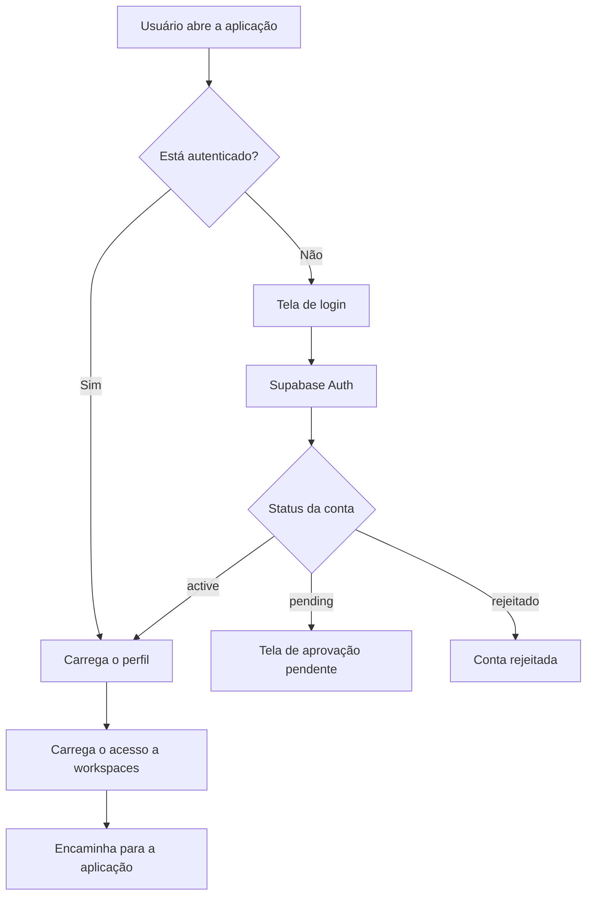

# Autenticação

> Como o LabHub autentica usuários?

## Visão geral

O LabHub usa o Supabase Auth. Os usuários se cadastram com e-mail e senha, e o perfil correspondente é armazenado na tabela `profiles`.

## Fluxo de autenticação



## Ciclo de vida do usuário

1. **Cadastro** — o perfil é criado com `status: 'pending'`
2. **Admin notificado** — notificação push com ações de aprovar ou recusar
3. **Admin aprova** — o status muda para `'active'` e o cargo é atribuído
4. **Usuário entra** — passa a ter acesso às aplicações permitidas

Um usuário com status `pending` não tem acesso ao sistema até a aprovação.

## Estrutura do perfil

```typescript
interface Profile {
  id: string          // = auth.users.id
  email: string
  name: string
  role: 'viewer' | 'technician' | 'admin'
  status: 'active' | 'pending'
  is_super_admin: boolean
  workspace_ids: string[]
  app_access: Record<string, 'full' | 'read' | 'none'>
  notify_settings: Record<string, boolean>
  avatar: string
  banner: string
}
```

## Contexto de autenticação (`src/core/auth/AuthContext.tsx`)

Disponibiliza:

- `user` — usuário autenticado
- `profile` — perfil carregado de `profiles`
- `loading` — estado de carregamento da autenticação
- `signIn()` / `signUp()` / `signOut()`
- `isSuperAdmin` — verificação de super admin

## Guards

| Guard | Propósito |
|-------|-----------|
| `AuthGuard` | Exige usuário autenticado |
| `AdminGuard` | Exige cargo admin ou super admin |
| `AppGuard` | Verifica o acesso à aplicação (habilitada no workspace e permitida ao usuário) |

## Relacionados

- [Autorização](authorization.md)
- [Workspaces](../concepts/workspaces.md)
- [Referência da API](../../reference/api.md)
