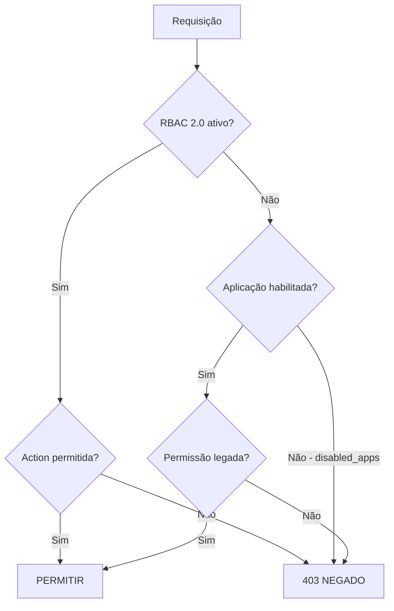

# Autorização

> Como o LabHub controla quem pode acessar o quê?

## Camadas de controle de acesso

O LabHub tem **quatro camadas** de controle de acesso, verificadas nesta ordem:



1. **RBAC 2.0** (backend, quando `RBAC_2_ENABLED=1`) — autorização granular por Action
2. **Gate de aplicação** — verificação de `disabled_apps` no workspace
3. **Cargo legado** — `profiles.role` combinado com `AppAccessLevel` (`dash`/`read`/`full`)
4. **RLS** — segurança em nível de linha para isolamento de workspace (sempre ativa)

## RBAC 2.0

O RBAC 2.0 é a camada **autoritativa** de autorização no backend. Quando habilitado (`RBAC_2_ENABLED=1`), cada endpoint protegido avalia uma **Action** contra a **membership** do usuário no workspace em questão.

### Motor de decisão

```text
super_admin       → PERMITE (todas as Actions, todos os workspaces)
membership        → busca a role do usuário no workspace
role_permissions  → verifica se a Action é concedida à role
overrides         → ajuste por Action sobrepõe a base da role
padrão            → NEGA (deny-by-default)
```

### Roles (migration 036)

| Slug | Nome | Escopo |
|------|------|--------|
| `tec` | Técnico | workspace |
| `vis` | Visualizador | workspace |
| `est` | Gestor de Estoque | workspace |
| `opv` | Operador TV | workspace |
| `adm` | Admin de Workspace | workspace |

Super Admin **não é uma role**: é a capacidade de plataforma `profiles.is_super_admin`.

### Como funciona

1. O usuário se autentica; `require_auth` popula `g.user` com o perfil
2. O decorator `require_action('ticket.view', scope='workspace')` ou a verificação `_require_action_in_handler(...)` é acionada
3. A engine resolve: bypass de super admin → membership → role_permissions → overrides → nega
4. A decisão é registrada em `rbac_audit_logs` (melhor esforço, append-only)
5. Negado → 403 "Permissão insuficiente"; permitido → a requisição prossegue

### Rotas protegidas por decorator

| Rota | Action | Escopo |
|------|--------|--------|
| `POST /api/tv/cloudinary/delete` | `tv.content.manage` | workspace |
| `POST /api/admin/wipe` | `admin.system.wipe` | global |
| `POST /api/admin/app-data/describe` | `admin.app.purge` | workspace |
| `POST /api/admin/app-data/purge` | `admin.app.purge` | workspace |
| `POST /api/chamados/reports/weekly-email` | `ticket.weeklyEmail` | global |
| `POST /api/admin/backups/prune` | `admin.backup.delete` | global |
| `POST /api/admin/backups/<id>/restore` | `admin.backup.restore` | global |
| `DELETE /api/admin/backups/<id>` | `admin.backup.delete` | global |
| `GET /api/admin/audit-logs` | `admin.audit.view` | global |
| `POST /api/admin/workspaces/<id>/delete` | `admin.workspace.delete` | global |
| `POST /api/push/send` | `reservelab.push.manage` | global |

### Enforcement no handler

Algumas rotas resolvem o workspace **depois** de buscar o recurso (por exemplo, os chamados por `<id>`). Nessas, usa-se `_require_action_in_handler()`:

| Rota | Action |
|------|--------|
| `GET /api/chamados/<id>` | `ticket.view` |
| `DELETE /api/chamados/<id>` | `ticket.delete` |
| `PATCH /api/chamados/<id>` | `ticket.status` / `ticket.assign` / `ticket.edit` (atômico) |
| `GET /api/chamados/<id>/events` | `ticket.view` |
| `POST /api/chamados/<id>/events` | `ticket.comment` |

### Feature flag

```bash
RBAC_2_ENABLED=1   # liga o RBAC; o legado continua ativo como fallback
RBAC_2_ENABLED=0   # RBAC vira no-op; valem apenas os gates legados
```

Com a flag desligada, todos os decorators e helpers são *no-op* e o comportamento existente é preservado.

### Rollback

Definir `RBAC_2_ENABLED=0` desativa imediatamente o enforcement. Não exige alteração de código nem deploy.

## Hierarquia de cargos legada

O modelo legado é preservado como **fallback** quando o RBAC está desligado:

| Cargo | Descrição |
|-------|-----------|
| `viewer` | Acesso somente leitura às aplicações atribuídas |
| `technician` | Pode atualizar chamados e gerenciar ativos |
| `admin` | Acesso completo às aplicações do workspace |
| `is_super_admin` | Ignora todas as restrições |

## Overrides de acesso por aplicação

Usuários podem ter ajustes de acesso por aplicação:

```json
{
  "reservalab": "full",
  "tv": "none",
  "chamados": "read"
}
```

Níveis de acesso:

- `full` — acesso completo
- `read` — somente leitura
- `none` — sem acesso

## Filtro por workspace

### Nível de banco (RLS)

```sql
-- Todas as tabelas de pcare/stock usam este padrão (migration 027)
CREATE POLICY "{table}_select" ON schema.table FOR SELECT
  USING (
    is_super_admin()
    OR user_belongs_to_workspace(workspace_id)
  );
-- INSERT/UPDATE/DELETE seguem o mesmo padrão
-- workspace_id nulo = registros legados, visíveis a todos
```

A função `user_belongs_to_workspace()` tem duas sobrecargas (text e uuid) para acompanhar os tipos de coluna em cada schema.

### Nível de frontend

```typescript
// workspaceStore.filter() aplica o filtro de workspace sobre os dados locais
workspaceStore.filter(items) // devolve apenas itens do workspace ativo
```

### Nível de backend

```python
# require_module() verifica workspace.disabled_apps antes das operações
def require_module(workspace_id, module_id):
    # retorna 403 MODULE_DISABLED se a aplicação estiver em disabled_apps
```

## Segmentação de notificações

As notificações push respeitam o escopo de workspace e cargo:

- Por aplicação: `module: 'chamados'`
- Por workspace: `workspace_id: '...'`
- Por cargo: `role: 'admin'`
- Por usuário: `userId: '...'`

## Relacionados

- [Autenticação](authentication.md)
- [Workspaces](../concepts/workspaces.md)
- [RBAC 2.0](../rbac/README.md)
- [Especificação do RBAC 2.0](../../architecture/rbac2.0-specification.md)
- [Catálogo de Actions](../../architecture/rbac2.0-actions-catalog.md)
- [Referência do banco](../../reference/database.md)
